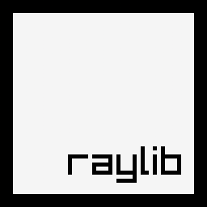

introduction
------------

I started developing videogames in 2006 and some years later I started teaching videogames development to young people with artistic profiles, most of students had never written a single line of code.

I decided to start with C language basis and, after searching for the most simple and easy-to-use library to teach videogames programming, I found [WinBGI](https://winbgim.codecutter.org/); it was great and it worked very well with students, in just a couple of weeks, those students that had never written a single line of code were able to program (and understand) a simple PONG game, some of them even a BREAKOUT!

But WinBGI was not the clearest and most organized library for my taste. There were lots of things I found confusing and some function names were not clear enough for most of the students; not to mention the lack of transparencies support and no hardware acceleration.

So, I decided to create my own library, hardware accelerated, clear function names, quite organized, well structured, plain C coding and, most importantly, primarily intended to learn videogames programming.

My previous videogames development experience was mostly in C# and [XNA](https://en.wikipedia.org/wiki/Microsoft_XNA) and I really loved it, so, I decided to use C# language style notation and XNA naming conventions. That way, students were able to move from raylib to XNA, MonoGame or similar libs extremely easily.

raylib started as a weekend project and after three months of hard work, **raylib 1.0 was published on November 2013**.

Enjoy it.

notes on raylib 1.1
-------------------

On April 2014, after 6 months of first raylib release, raylib 1.1 was released. This new version presents a complete internal redesign of the library to support OpenGL 1.1, OpenGL 3.3+ and OpenGL ES 2.0.

 - A new module named [rlgl](https://github.com/raysan5/raylib/blob/master/src/rlgl.h) has been added to the library. This new module translates raylib-OpenGL-style immediate mode functions (i.e. rlVertex3f(), rlBegin(), ...) to different versions of OpenGL (1.1, 3.3+, ES2), selectable by one define.

 - [rlgl](https://github.com/raysan5/raylib/blob/master/src/rlgl.h) also comes with a second new module named [raymath](https://github.com/raysan5/raylib/blob/master/src/raymath.h), which includes a bunch of useful functions for 3d-math with vectors, matrices and quaternions.

Some other big changes of this new version have been the support for OGG file loading and stream playing, and the support of DDS texture files (compressed and uncompressed) along with mipmaps support.

Lots of code changes and a lot of testing have concluded in this amazing new raylib 1.1.

notes on raylib 1.2
-------------------

On September 2014, after 5 months of raylib 1.1 release, it comes raylib 1.2. Again, this version presents a complete internal redesign of [core](https://github.com/raysan5/raylib/blob/master/src/rcore.c) module to support two new platforms: [Android](http://www.android.com/) and [Raspberry Pi](http://www.raspberrypi.org/).

It's been some months of really hard work to accommodate raylib to those new platforms while keeping it easy for the users. On Android, raylib manages internally the activity cycle, as well as the inputs; on Raspberry Pi, a complete raw input system has been written from scratch.

 - A new display initialization system has been created to support multiple resolutions, adding black bars if required; the user only defines the desired screen size and it gets properly displayed.

 - Now raylib can easily deploy games to Android devices and Raspberry Pi (console mode).

Lots of code changes and a lot of testing have concluded in this amazing new raylib 1.2.

In December 2014, new raylib 1.2.2 was published with support to compile directly for web (html5) using [emscripten](http://kripken.github.io/emscripten-site/) and [asm.js](http://asmjs.org/).

notes on raylib 1.3
-------------------

On September 2015, after 1 year of raylib 1.2 release, arrives raylib 1.3. This version adds shaders functionality, improves tremendously textures module and also provides some new modules (camera system, gestures system, immediate-mode gui).

 - Shaders support is the biggest addition to raylib 1.3, with support for easy shaders loading and use. Loaded shaders can be attached to 3d models or used as fullscreen post-processing effects. A bunch of postprocessing shaders are also included in this release, check raylib/shaders folder.

 - Textures module has grown to support most of the internal texture formats available in OpenGL (RGB565, RGB888, RGBA5551, RGBA4444, etc.), including compressed texture formats (DXT, ETC1, ETC2, ASTC, PVRT); raylib 1.3 can load .dds, .pkm, .ktx, .astc and .pvr files.

 - A brand new [camera](https://github.com/raysan5/raylib/blob/master/src/rcamera.h) module offers to the user multiple preconfigured ready-to-use camera systems (free camera, 1st person, 3rd person). Camera modes are very easy to use, just check examples: [core_3d_camera_free.c](https://github.com/raysan5/raylib/blob/master/examples/core/core_3d_camera_free.c) and [core_3d_camera_first_person.c](https://github.com/raysan5/raylib/blob/master/examples/core/core_3d_camera_first_person.c).

 - New [gestures](https://github.com/raysan5/raylib/blob/master/src/rgestures.h) module simplifies gestures detection on Android and HTML5 programs.

 - [raygui](https://github.com/raysan5/raylib/blob/master/examples/shapes/raygui.h), the new immediate-mode GUI module offers a set of functions to create simple user interfaces, primarily intended for tools development. It's still in an experimental state but already fully functional.

Most of the examples have been completely rewritten and +10 new examples have been added to show the new raylib features.

Lots of code changes and a lot of testing have concluded in this amazing new raylib 1.3.

notes on raylib 1.4
-------------------

On February 2016, after 4 months of raylib 1.3 release, it comes raylib 1.4. For this new version, lots of parts of the library have been reviewed, lots of bugs have been solved and some interesting features have been added.

 - First big addition is a set of [Image manipulation functions](https://github.com/raysan5/raylib/blob/master/src/raylib.h#L1331) that have been added to crop, resize, colorize, flip, dither and even draw image-to-image or text-to-image. Now basic image processing can be done before converting the image to texture for usage.

 - SpriteFonts system has been improved, adding support for AngelCode fonts (.fnt) and TrueType Fonts (using [stb_truetype](https://github.com/nothings/stb/blob/master/stb_truetype.h) helper library). Now raylib can read standard .fnt font data and also generate at loading a SpriteFont from a TTF file.

 - New [physac](https://github.com/raysan5/raylib/blob/master/src/physac.h) physics module for basic 2D physics support. Still in development but already functional. Module comes with some usage examples for basic jump and level interaction and also force-based physic movements.

 - [raymath](https://github.com/raysan5/raylib/blob/master/src/raymath.h) module has been reviewed; some bugs have been solved and the module has been converted to a header-only file for easier portability, optionally, functions can also be used as inline.

 - [gestures](https://github.com/raysan5/raylib/blob/master/src/rgestures.h) module has been redesigned and simplified, now it can process touch events from any source, including the mouse. This way, gestures system can be used on any platform providing a unified way to work with inputs and allowing the user to create multiplatform games with only one source code.

 - Raspberry Pi input system has been redesigned to better read raw inputs using generic Linux event handlers (keyboard:`stdin`, mouse:`/dev/input/mouse0`, gamepad:`/dev/input/js0`). Gamepad support has also been added (experimental).

Other important improvements are the functional raycast system for 3D picking, including some ray collision-detection functions,
and the addition of two simple functions for persistent data storage. Now raylib users can save and load game data in a file (only some platforms are supported). A simple [easings](https://github.com/raysan5/raylib/blob/master/examples/shapes/reasings.h) module has also been added for values animation.

Up to 8 new code examples have been added to show the new raylib features and +10 complete game samples have been provided to learn
how to create some classic games like Arkanoid, Asteroids, Missile Commander, Snake or Tetris.

Lots of code changes and lots of hours of hard work have concluded in this amazing new raylib 1.4.

notes on raylib 1.5
-------------------

On July 2016, after 5 months of raylib 1.4 release, arrives raylib 1.5. This new version is the biggest boost of the library until now, lots of parts of the library have been redesigned, lots of bugs have been solved and some **AMAZING** new features have been added.

 - VR support: raylib supports **Oculus Rift CV1**, one of the most anticipated VR devices in the market. Additionally, raylib supports simulated VR stereo rendering, independent of the VR device; it means, raylib can generate stereo renders with custom head-mounted-display device parameters, that way, any VR device in the market can be **simulated in any platform** just configuring device parameters (and consequently, lens distortion). To enable VR is [extremely easy](https://github.com/raysan5/raylib/blob/master/examples/core_oculus_rift.c).

 - New materials system: now raylib supports standard material properties for 3D models, including diffuse-ambient-specular colors and diffuse-normal-specular textures. Just assign values to standard material and everything is processed internally.

 - New lighting system: added support for up to 8 configurable lights and 3 light types: **point**, **directional** and **spot** lights. Just create a light, configure its parameters and raylib manages to render internally for every 3d object using standard material.

 - Complete gamepad support on Raspberry Pi: Gamepad system has been completely redesigned. Now multiple gamepads can be easily configured and used; gamepad data is read and processed in raw mode in a second thread.

 - Redesigned physics module: [physac](https://github.com/raysan5/raylib/blob/master/src/physac.h) module has been converted to header only and usage [has been simplified](https://github.com/raysan5/raylib/blob/master/examples/physics_basic_rigidbody.c). Performance has also been significantly improved, now physic objects are managed internally in a second thread.

 - Audio chiptunes support and mixing channels: Added support for module audio music (.xm, .mod) loading and playing. Multiple mixing channels are now also supported. All these features thanks to the amazing work of @kd7tck.

Other additions include a [2D camera system](https://github.com/raysan5/raylib/blob/master/examples/core/core_2d_rcamera.c), render textures for offline render (and most comprehensive [postprocessing](https://github.com/raysan5/raylib/blob/master/examples/shaders/shaders_postprocessing.c)) or support for legacy OpenGL 2.1 on desktop platforms.

This new version is so massive that is difficult to list all the improvements, most of the raylib modules have been reviewed and [rlgl](https://github.com/raysan5/raylib/blob/master/src/rlgl.h) module has been completely redesigned to accommodate to new material-lighting systems and stereo rendering. You can check [CHANGELOG](https://github.com/raysan5/raylib/blob/master/CHANGELOG) file for a more detailed list of changes.

Up to 8 new code examples have been added to show the new raylib features and also some samples to show the usage of [rlgl](https://github.com/raysan5/raylib/blob/master/examples/others/rlgl_standalone.c) and [audio](https://github.com/raysan5/raylib/blob/master/examples/audio_standalone.c) raylib modules as standalone libraries.

Lots of code changes (+400 commits) and lots of hours of hard work have concluded in this amazing new raylib 1.5.

notes on raylib 1.6
-------------------

On November 2016, only 4 months after raylib 1.5, arrives raylib 1.6. This new version represents another big review of the library and includes some interesting additions. This version commemorates raylib 3rd anniversary (raylib 1.0 was published on November 2013) and it is a stepping stone for raylib future. raylib roadmap has been reviewed and redefined to focus on its primary objective: create a simple and easy-to-use library to learn videogames programming. Some of the new features:

 - Complete [raylib Lua binding](https://github.com/raysan5/raylib-lua). All raylib functions plus the +60 code examples have been ported to Lua, now Lua users can enjoy coding videogames in Lua while using all the internal power of raylib. This addition also open the doors to Lua scripting support for a future raylib-based engine, being able to move game logic (Init, Update, Draw, De-Init) to Lua scripts while keep using raylib functionality.

 - Completely redesigned [audio module](https://github.com/raysan5/raylib/blob/master/src/raudio.c). Based on the new direction taken in raylib 1.5, it has been further improved and more functionality added (+20 new functions) to allow raw audio processing and streaming. [FLAC file format support](https://github.com/raysan5/raylib/blob/master/src/external/dr_flac.h) has also been added. In the same line, [OpenAL Soft](https://github.com/kcat/openal-soft) backend is now provided as a static library in Windows to allow static linking and get ride of OpenAL32.dll. Now raylib Windows games are completely self-contained, no external libraries are required anymore!

 - [Physac](https://github.com/victorfisac/Physac) module has been moved to its own repository and it has been improved A LOT, actually, the library has been completely rewritten from scratch by [@victorfisac](https://github.com/victorfisac), multiple samples have been added together with countless new features to match current standard 2D physic libraries. Results are amazing!

 - Camera and gestures modules have been reviewed, highly simplified and ported to single-file header-only libraries for easier portability and usage flexibility. Consequently, camera system usage has been simplified in all examples.

 - Improved Gamepad support on Windows and Raspberry Pi with the addition of new functions for custom gamepad configurations but supporting by default PS3 and Xbox-based gamepads.

 - Improved textures and text functionality, adding new functions for texture filtering control and better TTF/AngelCode fonts loading and generation support.

Build system improvement. Added support for raylib dynamic library generation (raylib.dll) for users that prefer dynamic library linking. Also thinking on advanced users, it has been added pre-configured [Visual Studio C++ 2015 solution](https://github.com/raysan5/raylib/tree/master/projects/vs2015) with raylib project and C/C++ examples for users that prefer that professional IDE and compiler.

New examples, new functions, complete code-base review, multiple bugs corrected... this is raylib 1.6. Enjoy making games.

notes on raylib 1.7
-------------------

On May 2017, around 6 months after raylib 1.6, comes another raylib installment, raylib 1.7. This time library has been improved a lot in terms of consistency and cleanness. As stated in [this patreon article](https://www.patreon.com/posts/raylib-future-7501034), this new raylib version has focused efforts in becoming more simple and easy-to-use to learn videogames programming. Some highlights of this new version are:

 - More than 30 new functions added to the library, functions to control Window, utils to work with filenames and extensions, functions to draw lines with custom thick, mesh loading, functions for 3d ray collisions detailed detection, functions for VR simulation and much more... Just check [CHANGELOG](CHANGELOG) for a detailed list of additions!

 - Support of [configuration flags](https://github.com/raysan5/raylib/issues/200) on every raylib module. Advanced users can customize raylib just by choosing desired features, and defining some configuration flags on modules compilation. That way users can control library size and available functionality.

 - Improved [build system](https://github.com/raysan5/raylib/blob/master/src/Makefile) for all supported platforms (Windows, Linux, OSX, RPI, Android, HTML5) with a unique Makefile to compile sources. Added support for Android compilation with a custom standalone toolchain and also multiple build compilation flags.

 - New [examples](http://www.raylib.com/examples.html) and [sample games](http://www.raylib.com/games.html) added. All sample material has been reviewed, removing useless examples and adding more comprehensive ones; all material has been ported to the latest raylib version and tested on multiple platforms. Examples folder structure has been improved and also build systems.

 - Improved library consistency and organization in general. Functions and parameters have been renamed, some parts of the library have been cleaned and simplified, some functions have been moved to examples (lighting, Oculus Rift CV1 support) towards a more generic library implementation. Lots of hours have been invested in this process...

Some other features: Gamepad support on HTML5, RPI touch screen support, 32bit audio support, frames timing improvements, public log system, rres file format support, automatic GIF recording...

And here is another version of **raylib, a simple and easy-to-use library to enjoy videogames programming**. Enjoy it.

notes on raylib 1.8
-------------------

October 2017, around 5 months after latest raylib version, another release is published: raylib 1.8. Again, several modules of the library have been reviewed and some new functionality added. Main changes of this new release are:

 - [Procedural image generation](https://github.com/raysan5/raylib/blob/master/examples/textures/textures_image_generation.c) function, a set of new functions have been added to generate gradients, checked, noise and cellular images from scratch. Image generation could be useful for certain textures or learning purposes.

 - [Parametric mesh generation](https://github.com/raysan5/raylib/blob/master/examples/models/models_mesh_generation.c) functions, create 3d meshes from scratch just defining a set of parameters, meshes like cube, sphere, cylinder, torus, knot and more can be very useful for prototyping or for lighting and texture testing.

 - PBR Materials support, a completely redesigned shaders and material system allows advanced materials definition and usage, with fully customizable shaders. Some new functions have been added to generate the environment textures required for PBR shading and a a new complete [PBR material example](https://github.com/raysan5/raylib/blob/master/examples/models/models_material_pbr.c) is also provided for reference.

 - Custom Android APK build pipeline with [simple Makefile](https://github.com/raysan5/raylib/blob/master/templates/simple_game/Makefile). Actually, full code building mechanism based on plain Makefile has been completely reviewed and Android building has been added for sources and also for examples and templates building into the final APK package. This way, raylib Android building has been greatly simplified and integrated seamlessly into standard build scripts.

 - [rlgl](https://github.com/raysan5/raylib/blob/master/src/rlgl.h) module has been completely reviewed and most of the functions renamed for consistency. This way, standalone usage of rlgl is promoted, with a [complete example provided](https://github.com/raysan5/raylib/blob/master/examples/others/rlgl_standalone.c). rlgl offers a pseudo-OpenGL 1.1 immediate-mode programming-style layer, with backends to multiple OpenGL versions.

 - [raymath](https://github.com/raysan5/raylib/blob/master/src/raymath.h) library has been also reviewed to align with other advance math libraries like [GLM](https://github.com/g-truc/glm). Matrix math has been improved and simplified, some new Quaternion functions have been added and Vector3 functions have been renamed all around the library for consistency with new Vector2 functionality.

Additionally, as always, examples and templates have been reviewed to work with new version (some new examples have been added), all external libraries have been updated to latest stable version and latest Notepad++ and MinGW have been configured to work with new raylib. For a full list of changes, just check [CHANGELOG](CHANGELOG).

New installer provided, web updated, examples re-builded, documentation reviewed... **new raylib 1.8 published**. Enjoy coding games.

notes on raylib 2.0
-------------------

It's been 9 months since last raylib version was published, a lot of things have changed since then... This new raylib version represents an inflection point in the development of the library and so, we jump to a new major version... Here is the result of almost **5 years and thousands of hours of hard work**... here is... **raylib 2.0**

In **raylib 2.0** the full API has been carefully reviewed for better consistency, some new functionality has been added and the overall raylib experience has been greatly improved... The key features of new version are:

 - **Complete removal of external dependencies.** Finally, raylib does not require external libraries to be installed and linked along with raylib, all required libraries are contained and compiled within raylib. Obviously some external libraries are required but only the strictly platform-dependent ones, the ones that come installed with the OS. So, raylib becomes a self-contained platform-independent games development library.

 - **Full redesign of audio module to use the amazing miniaudio library**, along with external dependencies removal, OpenAL library has been replaced by [miniaudio](https://github.com/dr-soft/miniaudio), this brand new library offers automatic dynamic linking with default OS audio systems. Undoubtedly, the perfect low-level companion for raylib audio module!

 - **Support for continuous integration building*** through AppVeyor and Travis CI. Consequently, raylib GitHub develop branch has been removed, simplifying the code-base to a single master branch, always stable. Every time a new commit is deployed, library is compiled for **up-to 12 different configurations**, including multiple platforms, 32bit/64bit and multiple compiler options! All those binaries are automatically attached to any new release!

 - **More platforms supported and tested**, including BSD family (FreeBSD, openBSD, NetBSD, DragonFly) and Linux-based family platforms (openSUSE, Debian, Ubuntu, Arch, NixOS...). raylib has already been added to some package managers! Oh, and last but not less important, **Android 64bit** is already supported by raylib!

 - **Support for TCC compiler!** Thanks to the lack of external dependencies, raylib can now be easily compiled with a **minimal toolchain**, like the one provided by Tiny C Compiler. It opens the door to an amazing future, allowing, for example, static linkage of libtcc for **runtime compilation of raylib-based code**... and the library itself if required! Moreover, TCC is blazing fast, it can compile all raylib in a couple of seconds!

 - Refactored all raylib configuration #defines into a **centralized `config.h` header**, with more than **40 possible configuration options** to compile a totally customizable raylib version including only desired options like supported file formats or specific functionality support. It allows generating a trully ligth-weight version of the library if desired!

A part of that, lots of new features, like a brand **new font rendering and packaging system** for TTF fonts with **SDF support** (thanks to the amazing STB headers), new functions for **CPU image data manipulation**, new orthographic 3d camera mode, a complete review of `raymath.h` single-file header-only library for better consistency and performance, new examples and way, [way more](https://github.com/raysan5/raylib/blob/master/CHANGELOG).

Probably by now, **raylib 2.0 is the simplest and easiest-to-use library to enjoy (and learn) videogames programming**... but, undoubtedly its development has exceeded any initial objective; raylib has become a simple and easy-to-use truly multiplatform portable standalone media library with thousands of possibilities... and that's just the beginning!

notes on raylib 2.5
-------------------

After almost one years since latest raylib installment, here is **raylib 2.5**. A lot of work has been put on this new version and consequently I decided to bump versioning several digits. The complete list of changes and additions is humungous, details can be found in the [CHANGELOG](CHANGELOG), and here is a short recap with the highlight improvements.

 - New **window management and file system functions** to query monitor information, deal with clipboard, check directory files info and even launch a URL with default system web browser. Experimental **High-DPI monitor support** has also been added through a compile flag.

 - **Redesigned Gamepad mechanism**, now generic for all platforms and gamepads, no more specific gamepad configurations.
**Redesigned UWP input system**, now raylib supports UWP seamlessly, previous implementation required a custom input system implemented in user code.

 - `rlgl` module has been redesigned to **support a unique buffer for shapes drawing batching**, including LINES, TRIANGLES, QUADS in the same indexed buffer, also added support for multi-buffering if required. Additionally, `rlPushMatrix()`/`rlPopMatrix()` functionality has been reviewed to behave exactly like OpenGL 1.1, `models_rlgl_solar_system` example has been added to illustrate this behavior.

 - **VR simulator** has been reviewed to **allow custom configuration of Head-Mounted-Device parameters and distortion shader**, `core_vr_simulator` has been properly adapted to showcase this new functionality, now the VR simulator is a generic configurable stereo rendering system that allows any VR device simulation with just a few lines of code or even dynamic tweaking of HMD parameters.

 - Support for **Unicode text drawing**; now raylib processes UTF8 strings on drawing, supporting Unicode codepoints, allowing rendering mostly any existent language (as long as the font with the glyphs is provided). An amazing example showing this feature has also been added: `text_unicode`.

 - Brand **new text management API**, with the addition of multiple functions to deal with string data, including functionality like replace, insert, join, split, append, to uppercase, to lower... Note that most of those functions are intended for text management on rendering, using pre-loaded internal buffers, avoiding new memory allocation that user should free manually.

 - Multiple **new shapes and textures drawing functions** to support rings (`DrawRing()`, `DrawRingLines()`), circle sectors (`DrawCircleSector()`, `DrawCircleSectorLines()`), rounded rectangles (`DrawRectangleRounded()`, `DrawRectangleRoundedLines()`) and also n-patch textures (`DrawTextureNPatch()`), detailed examples have been added to illustrate all this new functionality.

 - Experimental **cubemap support**, to automatically load multiple cubemap layouts (`LoadTextureCubemap()`). It required some internal `rlgl` redesign to allow cubemap textures.

 - **Skeletal animation support for 3d models**, this addition implied a redesign of `Model` data structure to accommodate multiple mesh/multiple materials support and bones information. Multiple models functions have been reviewed and added on this process, also **glTF models loading support** has been added.

This is just a brief list with some of the changes of the new **raylib 2.5** but there is way more, about **70 new functions** have been added and several subsystems have been redesigned. More than **30 new examples** have been created to show the new functionalities and better illustrate already available ones.

It has been a long year of hard work to make raylib a solid technology to develop new products over it.

notes on raylib 3.0
-------------------

After **10 months of intense development**, new raylib version is ready. Despite primary intended as a minor release, the [CHANGELIST](CHANGELOG) has grown so big and the library has changed so much internally that it finally became a major release. Library **internal ABI** has received a big redesign and review, targeting portability, integration with other platforms and making it a perfect option for other programming [language bindings](BINDINGS.md).

 - All **global variables** from the multiple raylib modules have been moved to a **global context state**, it has several benefits, first, better code readability with more comprehensive variable naming and categorization (organized by types, i.e. `CORE.Window.display.width`, `CORE.Input.Keyboard.currentKeyState` or `RLGL.State.modelview`). Second, it allows better memory management to load global context state dynamically when required (not at the moment), making it easy to implement a **hot-reloading mechanism** if desired.

 - All **memory allocations** on raylib and its dependencies now use `RL_MALLOC`, `RL_FREE` and similar macros. Now users can easily hook their own memory allocation mechanism if desired, having more control over memory allocated internally by the library. Additionally, it makes it easier to port the library to embedded devices where memory control is critical. For more info check raylib issue #1074.

 - All **I/O file accesses** from raylib are being moved to **memory data access**, now all I/O file access is centralized into just four functions: `LoadFileData()`, `SaveFileData()`, `LoadFileText()`, `SaveFileText()`. Users can just update those functions to any I/O file system. This change makes it easier to integrate raylib with **Virtual File Systems** or custom I/O file implementations.

 - All **raylib data structures** have been reviewed and optimized for pass-by-value usage. One of raylib distinctive design decisions is that most of its functions receive and return data by value. This design makes raylib really simple for newcomers, avoiding pointers and allowing complete access to all structures data in a simple way. The downside is that data is copied on stack every function call and that copy could be costly so, all raylib data structures have been optimized to **stay under 64 bytes** for fast copy and retrieve.

 - All **raylib tracelog messages** have been reviewed and categorized for a more comprehensive output information when developing raylib applications, now all display, input, timer, platform, auxiliar libraries, file-accesses, data loading/unloading issues are properly reported with more detailed and visual messages.

 - `raudio` module has been internally reviewed to accommodate the new `Music` structure (converted from previous pointer format) and the module has been adapted to the **highly improved** [`miniaudio v0.10`](https://github.com/dr-soft/miniaudio).

 - `text` module reviewed to **improve fonts generation** and text management functions, `Font` structure has been redesigned to better accommodate characters data, decoupling individual characters as `Image` glyphs from the font atlas parameters. Several improvements have been made to better support Unicode strings with UTF-8 encoding.

 - **Multiple new examples added** (most of them contributed by raylib users) and all examples reviewed for correct execution on most of the supported platforms, specially Web and Raspberry Pi. A detailed categorized table has been created on github for easy examples navigation and code access.

 - New **GitHub Actions CI** system has been implemented for Windows, Linux and macOS code and examples compilation on every new commit or PR to make sure library keeps stable and usable with no breaking bugs.

Note that only key changes are listed here but there is way more! About **30 new functions**, multiple functions reviewed, bindings to [+40 programming languages](https://github.com/raysan5/raylib/blob/master/BINDINGS.md) and great samples/demos/tutorials [created by the community](https://discord.gg/raylib), including raylib integration with [Spine](https://github.com/WEREMSOFT/spine-raylib-runtimes), [Unity](https://unitycoder.com/blog/2019/12/09/using-raylib-dll-in-unity/), [Tiled](https://github.com/OnACoffeeBreak/raylib_tiled_import_with_tmx), [Nuklear](http://bedroomcoders.co.uk/implementing-a-3d-gui-with-raylib/), [enet](https://github.com/nxrighthere/NetDynamics) and [more](https://github.com/raysan5/raylib/issues/1079)!

It has been **10 months of improvements** to create the best raylib ever.

Welcome to **raylib 3.0**.

notes on raylib 3.5 - 7th Anniversary Edition
---------------------------------------------

It's December 25th... this crazy 2020 is about to finish and finally the holidays gave me some time to put a new version of raylib. It's been **9 months since last release** and last November raylib become 7 years old... I was not able to release this new version back then but here it is. Many changes and improvements have happened in those months and, even, last August, raylib was awarded with an [Epic Megagrant](https://www.unrealengine.com/en-US/blog/epic-megagrants-fall-2020-update)! Bindings list kept growing to [+50 programming languages](BINDINGS.md) and some new platforms have been supported. Let's see this new version details:

First, some general numbers of this new update:

 - **+650** commits since previous RELEASE
 - **+30** functions ADDED (for a TOTAL of **475**!)
 - **+90** functions REVIEWED/REDESIGNED
 - **+30** contributors (for a TOTAL of **170**!)
 - **+8** new examples (for a TOTAL of **+120**!)

Here the list with some highlights for `raylib 3.5`.

 - NEW **Platform** supported: **Raspberry Pi 4 native mode** (no X11 windows) through [DRM](https://en.wikipedia.org/wiki/Direct_Rendering_Manager) subsystem and GBM API. Actually this is a really interesting improvement because it opens the door to raylib to support other embedded platforms (Odroid, GameShell, NanoPi...). Also worth mentioning the un-official homebrew ports of raylib for [PS4](https://github.com/orbisdev/orbisdev-orbisGl2) and [PSVita](https://github.com/psp2dev/raylib4Vita).

 - NEW **configuration options** exposed: For custom raylib builds, `config.h` now exposes **more than 150 flags and defines** to build raylib with only the desired features, for example, it allows to build a minimal raylib library in just some KB removing all external data filetypes supported, very useful to generate **small executables or embedded devices**.

 - NEW **automatic GIF recording** feature: Actually, automatic GIF recording (**CTRL+F12**) for any raylib application has been available for some versions but this feature was really slow and low-performant using an old gif library with many file accesses. It has been replaced by a **high-performant alternative** (`msf_gif.h`) that operates directly on memory... and actually works very well! Try it out!

 - NEW **RenderBatch** system: `rlgl` module has been redesigned to support custom **render batches** to allow grouping draw calls as desired, previous implementation just had one default render batch. This feature has not been exposed to raylib API yet but it can be used by advanced users dealing with `rlgl` directly. For example, multiple `RenderBatch` can be created for 2D sprites and 3D geometry independently.

 - NEW **Framebuffer** system: `rlgl` module now exposes an API for custom **Framebuffer attachments** (including cubemaps!). raylib `RenderTexture` is a basic use-case, just allowing color and depth textures, but this new API allows the creation of more advanced Framebuffers with multiple attachments, like the **G-Buffers**. `GenTexture*()` functions have been redesigned to use this new API.

 - Improved **software rendering**: raylib `Image*()` API is intended for software rendering, for those cases when **no GPU or no Window is available**. Those functions operate directly with **multi-format** pixel data on RAM and they have been completely redesigned to be way faster, specially for small resolutions and retro-gaming. Low-end embedded devices like **microcontrollers with custom displays** could benefit of this raylib functionality!

 - File **loading from memory**: Multiple functions have been redesigned to load data from memory buffers **instead of directly accessing the files**, now all raylib file loading/saving goes through a couple of functions that load data into memory. This feature allows **custom virtual-file-systems** and it gives more control to the user to access data already loaded in memory (i.e. images, fonts, sounds...).

 - NEW **Window states** management system: raylib `core` module has been redesigned to support Window **state check and setup more easily** and also **before/after Window initialization**, `SetConfigFlags()` has been reviewed and `SetWindowState()` has been added to control Window minification, maximization, hiding, focusing, topmost and more.

 - NEW **GitHub Actions** CI/CD system: Previous CI implementation has been reviewed and improved a lot to support **multiple build configurations** (platforms, compilers, static/shared build) and also an **automatic deploy system** has been implemented to automatically attach the different generated artifacts to every new release. As the system seems to work very good, previous CI platforms (AppVeyor/TravisCI) have been removed.

A part of those changes, many new functions have been added, some redundant functions removed and many functions have been reviewed for consistency with the full API (function name, parameters name and order, code formatting...). Again, this release represents is a **great improvement for raylib and marks the way forward** for the library. Make sure to check [CHANGELOG](CHANGELOG) for details! Hope you enjoy it!

Happy holidays! :)

notes on raylib 3.7
-------------------

April 2021, it's been about 4 months since the last raylib release and here is already a new one, this time with a bunch of internal redesigns and improvements. Surprisingly, on April 8th I was awarded for a second time with the [Google Open Source Peer Bonus Award](https://opensource.googleblog.com/2021/04/announcing-first-group-of-google-open-source-peer-bonus-winners.html) for my contribution to open source world with raylib and it seems the library is getting some traction, what a better moment for a new release? Let's see what can be found in this new version:

Let's start with some numbers:

 - **+100** closed issues (for a TOTAL of **+900**!)
 - **+400** commits since previous RELEASE
 - **+50** functions ADDED (**+30** of them to rlgl API)
 - **+30** functions REVIEWED/REDESIGNED
 - **+40** new contributors (for a TOTAL of **+210**!)

Highlights for `raylib 3.7`:

 - **REDESIGNED: `rlgl` module for greater abstraction level**. This suppose an **important change in raylib architecture**, now `rlgl` functionality is self-contained in the module and used by higher-level layers (specially by `core` module), those upper layers are the ones that expose functionality to the main API when required, for example the `Shaders`, `Mesh` and `Materials` functionality. Multiple `rlgl` functions have been renamed for consistency, in this case, following the `rl*()` prefix convention. Functions have also been reorganized internally by categories and `GenTexture*()` functions have been removed from the library and moved to [`models_material_pbr`](https://github.com/raysan5/raylib/blob/master/examples/models/models_material_pbr.c) example.

 - **REDESIGNED: VR simulator and stereo rendering mechanism**. A **brand new API** has been added, more comprehensive and better integrated with raylib, the **new stereo rendering** can be combined with `RenderTexture` and `Shader` API allowing the user to **manage fbo and distortion shader directly**. Also, the new rendering mechanism supports **instancing on stereo rendering**! Check the updated [`core_vr_simulator`](https://github.com/raysan5/raylib/blob/master/examples/core/core_vr_simulator.c) example for reference!

 - **ADDED: New file access callbacks system**. Several new callback functions have been added to the API to allow custom file loaders. A [nice example](https://github.com/RobLoach/raylib-physfs) it's the **raylib integration with a virtual file system** [PhysFS](https://icculus.org/physfs/).

 - **ADDED: glTF animations support**. glTF is the preferred models file format to be used with raylib and along the addition of a models animation API on latest raylib versions, now animations support for glTF format has come to raylib, thanks for this great contribution to [Hristo Stamenov](@object71)

 - **ADDED: Music streaming support from memory**. raylib has been adding the `Load*FromMemory()` option to all its supported file formats but **music streaming** was not supported yet... until now. Thanks to this great contribution by [Agnis "NeZvērs" Aldiņš](@nezvers), now raylib supports music streaming from memory data for all supported file formats: WAV, OGG, MP3, FLAC, XM and MOD.

 - **RENAMED: enums values for consistency**. Most raylib enums names and values names have been renamed for consistency, now all value names start with the type of data they represent. It increases clarity and readability when using those values and also **improves overall library consistency**.

Besides those key changes, many functions have been reviewed with improvements and bug fixes, many of them contributed by the community! Thanks! And again, this release sets a **new milestone for raylib library**. Make sure to check [CHANGELOG](CHANGELOG) for detailed list of changes! Hope you enjoy this new raylib installment!

Happy **gamedev/tools/graphics** programming! :)

notes on raylib 4.0 - 8th Anniversary Edition
---------------------------------------------

It's been about 6 months since last raylib release and it's been **8 years since I started with this project**, what an adventure! It's time for a new release: `raylib 4.0`, **the biggest release ever** and an inflection point for the library. Many hours have been put in this release to make it special, **many library details have been polished**: syntax, naming conventions, code comments, functions descriptions, log outputs... Almost all the issues have been closed (only 3 remain open at the moment of this writing) and some amazing new features have been added. I expect this **`raylib 4.0`** to be a long-term version (LTS), stable and complete enough for any new graphic/game/tool application development.

Let's start with some numbers:

 - **+130** closed issues (for a TOTAL of **+1030**!)
 - **+550** commits since previous RELEASE
 - **+20** functions ADDED to raylib API
 - **+60** functions ADDED to rlgl API
 - **+40** functions RENAMED/REVIEWED/REDESIGNED
 - **+60** new contributors (for a TOTAL of **+275**!)

Highlights for `raylib 4.0`:

 - **Naming consistency and coherency**: `raylib` API has been completely reviewed to be consistent on naming conventions for data structures and functions, comments and descriptions have been reviewed, also the syntax of many symbols for consistency; some functions and structs have been renamed (i.e. `struct CharInfo` to `struct GlyphInfo`). Output log messages have been also improved to show more info to the users. Several articles have been written in this process: [raylib_syntax analysis](https://github.com/raysan5/raylib/wiki/raylib-syntax-analysis) and [raylib API usage analysis](https://gist.github.com/raysan5/7c0c9fff1b6c19af24bb4a51b7383f1e). In general, a big polishment of the library to make it more consistent and coherent.

 - **Event Automation System**: This new _experimental_ feature has been added for future usage, it allows to **record input events and re-play them automatically**. This feature could be very useful to automatize examples testing but also for tutorials with assisted game playing, in-game cinematics, speedruns, AI playing and more! Note this feature is still experimental.

 - **Custom game-loop control**: As requested by some advanced users, **the game-loop control can be exposed** compiling raylib with the config flag: `SUPPORT_CUSTOM_FRAME_CONTROL`. It's intended for advanced users that want to control the events polling and also the timing mechanisms of their games.

 - [**`rlgl 4.0`**](https://github.com/raysan5/raylib/blob/master/src/rlgl.h): This module has been completely **decoupled from platform layer** and raylib, now `rlgl` single-file header-only library only depends on the multiple OpenGL backends supported, even the dependency on `raymath` has been removed. Additionally, **support for OpenGL 4.3** has been added, supporting compute shaders and Shader Storage Buffer Objects (SSBO). Now `rlgl` can be used as a complete standalone portable library to wrap several OpenGL version and providing **a simple and easy-to-use pseudo-OpenGL immediate-mode API**.

 - [**`raymath 1.5`**](https://github.com/raysan5/raylib/blob/master/src/raymath.h): This module has been reviewed and some new conventions have been adopted to make it **more portable and self-contained**:
   - Functions are self-contained, no function use other raymath function inside, required code is directly re-implemented
   - Functions input parameters are always received by value
   - Functions use always a "result" variable for return
   - Angles are always in radians (`DEG2RAD`/`RAD2DEG` macros provided for convenience)

 - [**`raygui 3.0`**](https://github.com/raysan5/raygui): The **official raylib immediate-mode gui library** (included in `raylib/src/extras`) has been updated to a new version, embedding the icons collection and adding mulstiple improvements. It has been simplified and constrained for a better focus on its task: provide a simple and easy-to-use immediate-mode-gui library for small tools development.

 - [**`raylib_parser`**](https://github.com/raysan5/raylib/tree/master/parser): Added **new tool to parse `raylib.h`** and tokenize its enums, structs and functions, extracting all required info (name, params, descriptions...) into custom output formats (TXT, XML, JSON...) for further processing. This tool is specially useful to **automatize bindings generation**. Hopefully, this tool will make life easier to binding creators to update their bindings for raylib 4.0 or adding new ones!

 - **Zig and Odin official support for raylib**: Those two new amazing programming languages are officially supporting raylib, `Zig` lists raylib as an [official example for C interoperatibility](https://ziglang.org/learn/samples/#c-interoperability) and Odin [officially supports raylib as a vendor library](https://github.com/odin-lang/Odin/tree/master/vendor/raylib). Both languages also have several bingings to raylib. Additionally, Zig build system supported has been added to compile raylib library and examples.

Those are some of the key features for this new release but actually there is way more! **Support for `VOX` ([MagikaVoxel](https://ephtracy.github.io/)) 3d model format** has been added, **new [raylib_game_template](https://github.com/raysan5/raylib-game-template)** repo shared, **new `EncodeDataBase64()` and `DecodeDataBase64()` functions** added, **improved HiDPI support**, new `DrawTextPro()` with support for text rotations, completely **reviewed `glTF` models loading**, added **`SeekMusicStream()` for music seeking**, many new examples and +20 examples reviewed... **hundreds of improvements and bug fixes**! Make sure to check [CHANGELOG](CHANGELOG) for a detailed list of changes!

Undoubtedly, **this is the best raylib ever**. Enjoy gamedev/tools/graphics programming! :)

notes on raylib 4.2
-------------------

**New raylib release!** Nine months after latest raylib, here is a new version. It was supposed to be just a small update but, actually, it's a huge update with lots of changes a improvements. It has been possible thanks to the many contributors that has helped with issues and improvements, it's the **update with more contributors to date** and that's amazing!

Some numbers to start with:

 - **+200** closed issues (for a TOTAL of **1230**!)
 - **+540** commits since previous RELEASE (for a TOTAL of **+6000**!)
 - **+20** functions ADDED to raylib API (for a TOTAL of **502**!)
 - **+60** functions REVIEWED/REDESIGNED
 - **+70** new contributors (for a TOTAL of **+360**!)

Highlights for `raylib 4.2`:

 - **raylib extra libraries cleanup**: raylib has been on diet and all the _extra_ libraries included on previous releases have been removed from raylib. Now raylib only includes the original **7** raylib modules: `rcore`, `rlgl`, `rshapes`, `rtextures`, `rtext`, `rmodels` and `raudio`. But no worries, _extra_ libraries have not been deleted, they have been moved to their own repos for better maintainability and more focus on its functionality. The libraries moved out from raylib repo are: [`raygui`](https://github.com/raysan5/raygui), [`physac`](https://github.com/raysan5/physac), [`rmem`](https://github.com/raylib-extras/rmem), [`reasings`](https://github.com/raylib-extras/reasings) and [`raudio`](https://github.com/raysan5/raudio) (standalone mode). On that same line, a new **amazing GitHub group:** [`raylib-extras`](https://github.com/raylib-extras) has been created by @JeffM2501 to contain raylib extra libraries as well as other raylib add-ons provided by the community. Jeff has done an amazing work on that line, providing multiple libraries and examples for raylib, like [custom first-person and third person camera systems](https://github.com/raylib-extras/extras-c/tree/main/cameras), [Dear ImGui raylib integration](https://github.com/raylib-extras/rlImGui), [multiple specific examples](https://github.com/raylib-extras/examples-c) and even a complete [RPG Game Example](https://github.com/raylib-extras/RPGExample)! Great work Jeff! :D

 - **raylib examples review**: The +120 raylib examples have been reviewed to add clearer information about when the were first created (raylib version used) and when they were updated for the last time. But the greatest improvement for users has been the **addition of an estimated difficulty level** for every example, [web has been updated accordingly](https://www.raylib.com/examples.html) to reflect those difficulty levels. Now examples are classified with **1 to 4 stars** depending on difficulty to help users with their learning process. Personally, I think this "small" addition could be a game-changer to better guide new users on the library adoption! Additionally, this new raylib release includes 7 new examples; the most interesting one: [`text_codepoints_loading`](https://www.raylib.com/examples/text/loader.html?name=text_codepoints_loading) that illustrates how to load and draw custom codepoints from a font file, very useful for Asian languages.

 - [**`rres 1.0`**](https://github.com/raysan5/rres): New `rres` **resources packaging file-format**, including a [`rres-raylib`](https://github.com/raysan5/rres/blob/master/src/rres-raylib.h) library implementation and [`rrespacker`](https://raylibtech.itch.io/rrespacker) tool. `rres` file format has been [under development for +8 years](https://github.com/raysan5/rres#design-history) and it was originally created to be part of raylib. It was highly inspired by _XNA XNB_ resources file format but design has changed a lot along the years. This first release of the format specs is engine-agnostic and has been designed to be portable to any engine, including lots of professional features like data processing, compression and encryption.

 - [**`raygui 3.2`**](https://github.com/raysan5/raygui): The **official raylib immediate-mode gui library** designed for tools development has been updated to a new version aligned with raylib 4.2. Multiple controls have been reviewed for library consistency, now all controls follow a similar function signature. It has been battle-tested with the development of +8 published tools in the last months. The tools can be seen and used for free in the [raylib technologies tools page](https://raylibtech.itch.io/). Worth mentioning that several of those **tools have been open sourced** for anyone to use, compile, contribute or learn how the code works.

 - [**`raylib_parser`**](https://github.com/raysan5/raylib/tree/master/parser): Multiple contributors **using the tool to automatize bindings creation** have contributed with improvements of this **tool to parse `raylib.h`** (and other raylib-style headers) to tokenize its enums, structs and functions. Processed data can be exported to custom file formats (i.e XML, JSON, LUA) for bindings generation or even docs generation if required.

 - **New file system API**: Current API has been redesigned to be more comprehensive and better aligned with raylib naming conventions, two new functions are provided `LoadDirectoryFiles()`/`LoadDirectoryFilesEx()` to load a `FilePathList` for provided path, supporting extension filtering and recursive directory scan. `LoadDroppedFiles()` has been renamed to better reflect its internal functionality. Now, all raylib functions that start with `Load*()` allocate memory internally and a equivalent `Unload*()` function is defined to take care of that memory internally when not required any more!

 - **New audio stream processors API** (_experimental_): Now real-time audio stream data processors can be added using callbacks to played Music. It allows users to create custom effects for audio like delays of low-pass-filtering (example provided). The new API uses a callback system and it's still _ highly experimental_, it differs from the usual level of complexity that provides raylib and it is intended for advanced users. It could change in the future but, actually, `raudio` module is in the spotlight for future updates; [miniaudio](https://github.com/mackron/miniaudio) implements a new higher-level API that can be useful in the future for raylib.

As always, there are more improvements than the key features listed, make sure to check raylib [CHANGELOG](CHANGELOG) for the detailed list of changes; for this release a `WARNING` flag has been added to all the changes that could affect bindings or productivity code. **raylib keeps improving one more version** and a special focus on maintainability has been put on the library for the future. Specific/advance functionality will be provided through **raylib-extras** repos and raylib main repo devlelopment will be focused on what made raylib popular: being a simple and easy-to-use library to **enjoy videogames programming**.

**Enjoy gamedev/tools/graphics programming!** :)

notes on raylib 4.5
-------------------

It's been **7 months** since latest raylib release. As usual, **many parts of the library have been reviewed and improved** along those months. Many issues have been closed, staying under 10 open issues at the moment of this writting and also many PRs from contributors have been received, reviewed and merged into raylib library. Some new functions have been added and some others have been removed to improve library coherence and avoid moving too high level, giving the users the tools to implement advance functionality themselfs over raylib. Again, this is a big release with a considerable amount of changes and improvements. Here is a small summary highlighting this new **rayib 4.5**.

Some numbers for this release:

 - **+100** closed issues (for a TOTAL of **+1340**!)
 - **+350** commits since previous RELEASE (for a TOTAL of **+6350**!)
 - **+25** functions ADDED to raylib API (for a TOTAL of **516**!)
 - **+40** functions REVIEWED/REDESIGNED
 - **+40** new contributors (for a TOTAL of **405**!)

Highlights for `raylib 4.5`:

 - **`NEW` Improved ANGLE support on Desktop platforms**: Support for OpenGL ES 2.0 on Desktop platforms (Windows, Linux, macOS) has been reviewed by @wtnbgo GitHub user. Now raylib can be compiled on desktop for OpenGL ES 2.0 and linked against [`ANGLE`](https://github.com/google/angle). This _small_ addition open the door to building raylib for all **ANGLE supported backends: Direct3D 11, Vulkan and Metal**. Please note that this new feature is still experimental and requires further testing!

 - **`NEW` Camera module**: A brand new implementation from scratch for `rcamera` module, contributed by @Crydsch GitHub user! **New camera system is simpler, more flexible, more granular and more extendable**. Specific camera math transformations (movement/rotation) have been moved to individual functions, exposing them to users if required. Global state has been removed from the module and standalone usage has been greatly improved; now `rcamera.h` single-file header-only library can be used externally, independently of raylib. A new `UpdateCameraPro()` function has been added to address input-dependency of `UpdateCamera()`, now advanced users have **full control over camera inputs and movement/rotation speeds**!

 - **`NEW` Support for M3D models and M3D/GLTF animations**: 3d models animations support has been a limited aspect of raylib for long time, some versions ago IQM animations were supported but raylib 4.5 also adds support for the brand new [M3D file format](https://bztsrc.gitlab.io/model3d/), including animations and the long expected support for **GLTF animations**! The new M3D file format is **simple, portable, feature complete, extensible and open source**. It also provides a complete set of tools to export/visualize M3D models from/to Blender! Now raylib supports up to **3 model file-formats with animations**: `IQM`, `GLTF` and `M3D`.

 - **`NEW` Support QOA audio format (import/export)**: Just a couple of months ago the new [QOA file format](https://qoaformat.org/) was published, a very simple, portable and open source quite-ok-audio file format. raylib already supports it, added to `raudio` module and including audio loading from file, loading from memory, streaming from file, streaming from memory and **exporting to QOA** audio format. **Because simplicity really matters to raylib!**

 - **`NEW` Module for compressed textures loading**: [`rl_gputex`](https://github.com/raysan5/raylib/blob/master/src/external/rl_gputex.h), a portable single-file header-only small library to load compressed texture file-formats (DDS, PKM, KTX, PVR, ASTC). Provided functionality is not new to raylib but it was part of the raylib `rtextures` module, now it has been moved into a separate self-contained library, **improving portability**. Note that this module is only intended to **load compressed data from files, ready to be uploaded to GPU**, no compression/decompression functionality is provided. This change is a first step towards a better modularization of raylib library.

 - **Reviewed `rlgl` module for automatic limits checking**: Again, [`rlgl`](https://github.com/raysan5/raylib/blob/master/src/rlgl.h) has been reviewed to simplify usage. Now users do not need to worry about reaching the internal render-batch limits when they send their triangles to draw 2d/3d, `rlgl` manages it automatically! This change allows a **great simplification for other modules** like `rshapes`, `rtextures` and `rmodels` that do not need to worry about bufffer overflows and can just define as many vertex as desired!

 - **Reviewed `rshapes` module to minimize the rlgl dependency**: Now `rshapes` 2d shapes drawing functions **only depend on 6 low-level functions**: `rlBegin()`, `rlEnd()`, `rlVertex3f()`, `rlTexCoord2f()`, `rlNormal3f()`, `rlSetTexture()`. With only those pseudo-OpenGl 1.1 minimal functionality, everything can be drawn! This improvement converts `rshapes` module in a **self-contained, portable shapes-drawing library that can be used independently of raylib**, as far as entry points for those 6 functions are provided by the user. It even allows to be used for software rendering, with the proper backend!

 - **Added data structures validation functions**: Multiple functions have been added by @RobLoach GitHub user to ease the validation of raylib data structures: `IsImageReady()`, `IsTextureReady()`, `IsSoundReady()`... Now users have a simple mechanism to **make sure data has been correctly loaded**, instead of checking internal structure values by themselves.

As usual, those are only some highlights but there is much more! New image generators, new color transformation functionality, improved blending support for color/alpha, etc... Make sure to check raylib [CHANGELOG]([CHANGELOG](https://github.com/raysan5/raylib/blob/master/CHANGELOG)) for a detailed list of changes! Please, note that all breaking changes have been flagged with a `WARNING` in the CHANGELOG, specially useful for binding creators!

**raylib keeps improving one more version** with a special focus on maintainability and sustainability. Always working towards making the library more **simple and easy-to-use**.

Let's keep **enjoying games/tools/graphics programming!** :)

notes on raylib 5.0
-------------------

It's been **7 months** since latest raylib release and **10 years** since raylib 1.0 was officially released... what an adventure! In the last 10 years raylib has improved a lot, new functions have been added, many new features and improvements implemented, up to **500 contributors** have helped to shape the library as it is today. `raylib 5.0` is the final result of all this incredible amount of work and dedication. Here is the summary with the key features and additions of this NEW major version of raylib.

Some numbers for this release:

 - **+200** closed issues (for a TOTAL of **+1540**!)
 - **+550** commits since previous RELEASE (for a TOTAL of **+6950**!)
 - **+35** functions ADDED to raylib API (for a TOTAL of **552**!)
 - **+60** functions REVIEWED/REDESIGNED
 - **+80** new contributors (for a TOTAL of **+500**!)

Highlights for `raylib 5.0`:

 - **`rcore` module platform-split**: Probably the biggest raylib redesign in the last 10 years. raylib started as a library targeting 3 desktop platforms: `Windows`, `Linux` and `macOS` (thanks to `GLFW` underlying library) but with the years support for several new platforms has been added (`Android`, `Web`, `Rapsberry Pi`, `RPI native`...); lot of the platform code was shared so the logic was all together on `rcore.c` module, separated by compilation flags. This approach was very handy but also made it very difficult to support new platforms and specially painful for contributors not familiar with the module, navigating +8000 lines of code in a single file. A big redesign was really needed but the amount of work required was humungous and quite scary for a solo-developer like me, moreover considering that everything was working and the chances to break things were really high. Fortunately, some contributors were ready for the task (@ubkp, @michaelfiber, @Bigfoot71) and thanks to their initiative and super-hard work, the `rcore` [platform split](https://github.com/raysan5/raylib/blob/master/src/platforms) has been possible! This new raylib architecture greatly improves the platforms maintenance but also greatly simplifies the addition of new platforms. A [`platforms/rcore_template.c`](https://github.com/raysan5/raylib/blob/master/src/platforms/rcore_template.c) file is provided with the required structure and functions to be filled for the addition of new platforms, actually it has been simplified to mostly filling some pre-defined functions: `InitPlatform()`, `ClosePlatform`, `PollInputEvents`... Undoubtedly, **this redesign opens the doors to a new era for raylib**, letting the users to plug new platforms as desired.
 
 - **`NEW` Platform backend supported: SDL**: Thanks to the new `rcore` platform-split, the addition of new platforms/backends to raylib has been greatly simplified. As a proof of concept, [`SDL2`](https://libsdl.org/) platform backend has been added to raylib as an alternative for `GLFW` library for desktop builds: [`platforms/rcore_desktop_sdl`](https://github.com/raysan5/raylib/blob/master/src/platforms/rcore_desktop_sdl.c). Lot of work has been put to provide exactly the same features as the other platforms and carefully test the new implementation. Now `SDL2` fans can use this new backend, just providing the required include libraries on compilation and linkage (not included in raylib, like `GLFW`). `SDL` backend support also **eases the process of supporting a wider range of platforms** that already support `SDL`.

 - **`NEW` Platform backend supported: Nintendo Switch (closed source)**: The addition of the `SDL` backend was quite a challenge but to really verify the robustness and ease of the new platform plugin system, adding support for a console was a more demanding adventure. Surprisingly, only two days of work were required to add support for `Nintendo Switch` to raylib! Implementation result showed an outstanding level of simplicity, with a **self-contained module** (`rcore_swith.cpp`) supporting graphics and inputs. Unfortunately this module can not be open-sourced due to licensing restrictions.

 - **`NEW` Splines drawing and evaluation API**: A complete set of functions has been added to [draw](https://github.com/raysan5/raylib/blob/master/src/raylib.h#L1258) and [evaluate](https://github.com/raysan5/raylib/blob/master/src/raylib.h#L1270) different types of splines: `Linear`, `Basis`, `Catmull-Rom`, `Quadratic Bezier` and `Cubic Bezier`. Splines are extremely useful for game development (describe paths, control NPC movement...) but they can also be very useful on tools development (node-conections, elements-movement, 3d modelling, animations...). This was the missing feature on the raylib [`rshapes`](https://github.com/raysan5/raylib/blob/master/src/rshapes.h) module to make it complete! Note that `rshapes` module can also be used independently of raylib just providing the **only 6 functions required for vertex definition and drawing**.
 
 - **`NEW` Pseudo-random numbers generator: rprand**: After several years of users asking for this missing piece, a brand new pseudo-random generator module has been added to raylib. [`rprand`](https://github.com/raysan5/raylib/blob/master/src/external/rprand.h) implements the `Xoshiro128**` algorithm combined with `SplitMix64`, specially suited for **fast software pseudo-random numbers generation**. The module also implies some useful functions to generate non-repetitive random numbers sequences, functionality exposed by raylib. usage of this module can be controlled by a compilation flag, in case the default libc `rand()` function was preferred.

 - **`NEW` Automation Events System API**: This new system was first added in `raylib 4.0` as an experimental feature but it was a bit clumsy and there was no API exposed to users. For the new `raylib 5.0` the system has been redesigned and [proper API](https://github.com/raysan5/raylib/blob/master/src/raylib.h#L1135) added for the users. With this new events automation system, users can **record input events for later replay**, very useful feature for testing automation, tutorials generation, assisted game playing, in-game cinematics, speedruns saving or even AI assited game playing!

 - **`NEW` [`raygui 4.0`](https://github.com/raysan5/raygui)**: The **official raylib immediate-mode gui library** designed for tools development has been updated to a new version, aligned with raylib 5.0. This new version is a complete redesign of raygui to unify all controls structure and usage, now all controls have the same function signature!. `raygui` has been battle-tested with the development of +12 published tools in the last few years. The tools can be seen and used for free in the [raylib technologies tools page](https://raylibtech.itch.io/). Worth mentioning that several of those **tools have been open sourced** for anyone to use, compile, contribute or learn how the code works.

 - **`NEW` raylib web examples functionality**: Beside the addition of several new examples, the web examples functionality has been improved. Examples have been organized by [complexity level](https://www.raylib.com/examples.html), marked with one star for simple examples and up to 4 stars for more complex ones. A new option has been added to web to allow to **filter examples by function-name** usage, to ease the learning process when looking for an usage example of some function. Finally, **open-graph metadata** information has been added to all examples individual webpages, improving a the visuals and information when sharing those webpages on social networks, sharing the example screenshot and details.

As always, those are only some highlights of the new `raylib 5.0` but there is many more improvements! Support for 16-bit HDR images/textures, SVG loading and scaling support, new OpenGL ES 3.0 graphic backend, new image gradient generators, sound alias loading, improved 3d models loading, multiple optimizations, new bindings, CodeQL integration and much more! 
 
Make sure to check raylib [CHANGELOG]([CHANGELOG](https://github.com/raysan5/raylib/blob/master/CHANGELOG)) for a detailed list of changes!

Undoubtedly, this is the **biggest raylib update in 10 years**. Many new features and improvements with a special focus on maintainability and long-term sustainability. **Undoubtedly, this is the raylib of the future**.

**Enjoy programming!** :)

notes on raylib 5.5
-------------------

One year after raylib 5.0 release, arrives `raylib 5.5`, the next big revision of the library. It's been **11 years** since raylib 1.0 release and in all this time it has never stopped growing and improving. With an outstanding number of new contributors and improvements, it's, again, the biggest raylib release to date.

Some numbers for this release:

 - **+270** closed issues (for a TOTAL of **+1810**!)
 - **+800** commits since previous RELEASE (for a TOTAL of **+7770**!)
 - **+30** functions ADDED to raylib API (for a TOTAL of **580**!)
 - **+110** functions REVIEWED with fixes and improvements
 - **+140** new contributors (for a TOTAL of **+640**!)

Highlights for `raylib 5.5`:

 - **`NEW` raylib pre-configured Windows package**: The new raylib **portable and self-contained Windows package** for `raylib 5.5`, intended for nobel devs that start in programming world, comes with one big addition: support for **C code building for Web platform with one-single-mouse-click!** For the last 10 years, the pre-configured raylib Windows package allowed to edit simple C projects on Notepad++ and easely compile Windows executables with an automatic script; this new release adds the possibility to compile the same C projects for Web platform with a simple mouse click. This new addition **greatly simplifies C to WebAssembly project building for new users**. The `raylib Windows Installer` package can be downloaded for free from [raylib on itch.io](https://raysan5.itch.io/raylib).

 - **`NEW` raylib project creator tool**: A brand new tool developed to help raylib users to **setup new projects in a professional way**. `raylib project creator` generates a complete project structure with **multiple build systems ready-to-use** and **GitHub CI/CD actions pre-configured**. It only requires providing some C files and basic project parameters! The tools is [free and open-source](https://raysan5.itch.io/raylib-project-creator), and [it can be used online](https://raysan5.itch.io/raylib-project-creator)!.

 - **`NEW` Platform backend supported: RGFW**: Thanks to the `rcore` platform-split implemented in `raylib 5.0`, **adding new platforms backends has been greatly simplified**, new backends can be added using provided template, self-contained in a single C module, completely portable. A new platform backend has been added: [`RGFW`](https://github.com/raysan5/raylib/blob/master/src/platforms/rcore_desktop_rgfw.c). `RGFW` is a **new single-file header-only portable library** ([`RGFW.h`](https://github.com/ColleagueRiley/RGFW)) intended for platform-functionality management (windowing and inputs); in this case for **desktop platforms** (Windows, Linux, macOS) but also for **Web platform**. It adds a new alternative to the already existing `GLFW` and `SDL` platform backends.
 
 - **`NEW` Platform backend version supported: SDL3**: Previous `raylib 5.0` added support for `SDL2` library, and `raylib 5.5` not only improves SDL2 functionality, with several issues reviewed, but also adds support for the recently released big SDL update in years: [`SDL3`](https://wiki.libsdl.org/SDL3/FrontPage). Now users can **select at compile time the desired SDL version to use**, increasing the number of potential platforms supported in the future!
 
 - **`NEW` Retro-console platforms supported: Dreamcast, N64, PSP, PSVita, PS4**: Thanks to the platform-split on `raylib 5.0`, **supporting new platform backends is easier than ever!** Along the raylib `rlgl` module support for the  `OpenGL 1.1` graphics API, it opened the door to [**multiple homebrew retro-consoles backend implementations!**](https://github.com/raylib4Consoles) It's amazing to see raylib running on +20 year old consoles like [Dreamcast](https://github.com/raylib4Consoles/raylib4Dreamcast), [PSP](https://github.com/raylib4Consoles/raylib4Psp) or [PSVita](https://github.com/psp2dev/raylib4Vita), considering the hardware constraints of those platforms and proves **raylib outstanding versability!** Those additional platforms can be found in separate repositories and have been created by the amazing programmer Antonio Jose Ramos Marquez (@psxdev).
 
 - **`NEW` GPU Skinning support**: After lots of requests for this feature, it has been finally added to raylib thanks to the contributor Daniel Holden (@orangeduck), probably the developer that has further pushed models animations with raylib, developing two amazing tools to visualize and test animations: [GenoView](https://github.com/orangeduck/GenoView) and [BVHView](https://github.com/orangeduck/BVHView). Adding GPU skinning was a tricky feature, considering it had to be **available for all raylib supported platforms**, including limited ones like Raspberry Pi with OpenGL ES 2.0, where some advance OpenGL features are not available (UBO, SSBO, Transform Feedback) but a multi-platform solution was found to make it possible. A new example, [`models_gpu_skinning`](https://github.com/raysan5/raylib/blob/master/examples/models/models_gpu_skinning.c) has been added to illustrate this new functionality. As an extra, previous existing CPU animation system has been greatly improved, multiplying performance by a factor (simplifiying required maths).
 
 - **`NEW` [`raymath`](https://github.com/raysan5/raylib/blob/master/src/raymath.h) C++ operators**: After several requested for this feature, C++ math operators for `Vector2`, `Vector3`, `Vector4`, `Quaternion` and `Matrix` has been added to `raymath` as an extension to current implementation. Despite being only available for C++ because C does not support it, these operators **simplify C++ code when doing math operations**.

Beside those new big features, `raylib 5.5` comes with MANY other improvements: 

- Normals support on batching system
- Clipboard images reading support
- CRC32/MD5/SHA1 hash computation
- Gamepad vibration support
- Improved font loading (no GPU required) with BDF fonts support
- Time-based camera movement
- Improved GLTF animations loading

...and [much much more](https://github.com/raysan5/raylib/blob/master/CHANGELOG), including **many functions reviews and new functions added!**
 
Make sure to check raylib [CHANGELOG](https://github.com/raysan5/raylib/blob/master/CHANGELOG) for a detailed list of changes!

To end with, I want to **thank all the contributors (+640!**) that along the years have **greatly improved raylib** and pushed it further and better day after day. Thanks to all of them, raylib is the amazing library it is today.

Last but not least, I want to thank **raylib sponsors and all the raylib community** for their support and continuous engagement with the library, creating and sharing amazing raylib projects on a daily basis. **Thanks for making raylib a great platform to enjoy games/tools/graphic programming!**

**After 11 years of development, `raylib 5.5` is the best raylib ever.**

**Enjoy programming with raylib!** :)
