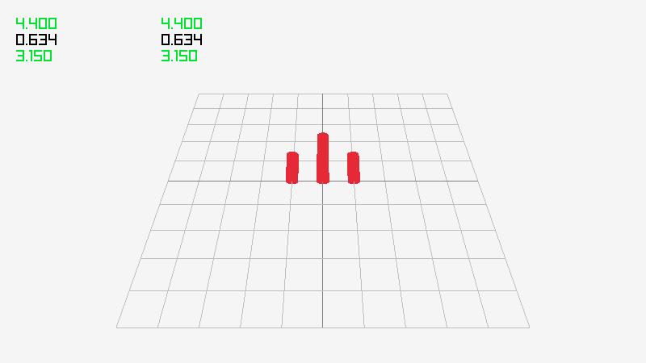
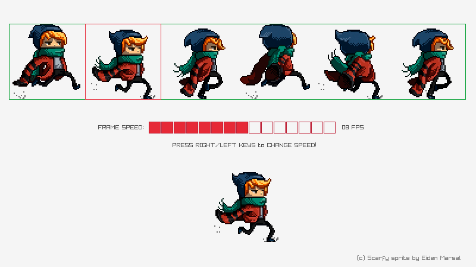
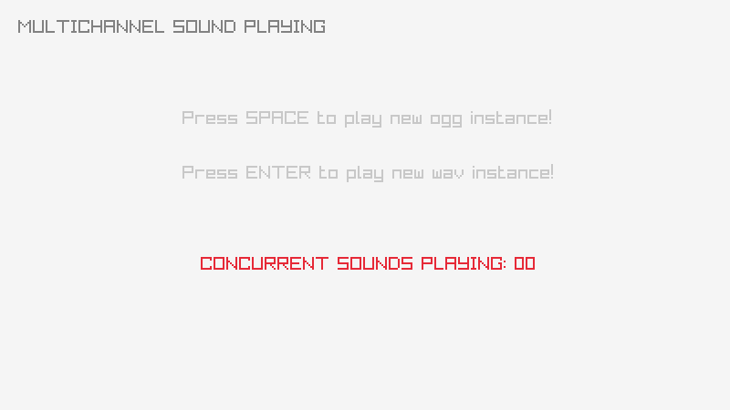

## Building the Examples

The examples assume you have already built the `raylib` library in `../src`.

### With GNU make

- `make` builds all examples
- `make [module]` builds all examples for a particular module (e.g `make core`)

### With Zig

The [Zig](https://ziglang.org/) toolchain can compile `C` and `C++` in addition to `Zig`.
You may find it easier to use than other toolchains, especially when it comes to cross-compiling.

- `zig build` to compile all examples
- `zig build [module]` to compile all examples for a module (e.g. `zig build core`)
- `zig build [example]` to compile _and run_ a particular example (e.g. `zig build core_basic_window`)

## EXAMPLES LIST

### category: core

Examples using raylib core platform functionality like window creation, inputs, drawing modes and system functionality.

| ## | example  | image  | developer  | new |
|----|----------|--------|:----------:|:---:|
| 01 | [core_basic_window](core/core_basic_window.c)                     |                      | ray                                               |        |
| 02 | [core_input_keys](core/core_input_keys.c)                         |                          | ray                                               |        |
| 03 | [core_input_mouse](core/core_input_mouse.c)                       |                        | ray                                               |        |
| 04 | [core_input_mouse_wheel](core/core_input_mouse_wheel.c)           |            | ray                                               |        |
| 05 | [core_input_gamepad](core/core_input_gamepad.c)                   |                    | ray                                               |        |
| 06 | [core_input_multitouch](core/core_input_multitouch.c)             |              | [Berni](https://github.com/Berni8k)               |        |
| 07 | [core_input_gestures](core/core_input_gestures.c)                 |                  | ray                                               |        |
| 08 | [core_2d_camera](core/core_2d_camera.c)                           |                            | ray                                               |        |
| 09 | [core_2d_camera_platformer](core/core_2d_camera_platformer.c)     |      | [avyy](https://github.com/avyy)                   | ⭐️     |
| 10 | [core_3d_camera_mode](core/core_3d_camera_mode.c)                 |                  | ray                                               |        |
| 11 | [core_3d_camera_free](core/core_3d_camera_free.c)                 |                  | ray                                               |        |
| 12 | [core_3d_camera_first_person](core/core_3d_camera_first_person.c) |  | ray                                               |        |
| 13 | [core_3d_picking](core/core_3d_picking.c)                         |                          | ray                                               |        |
| 14 | [core_world_screen](core/core_world_screen.c)                     |                      | ray                                               |        |
| 15 | [core_custom_logging](core/core_custom_logging.c)                 |                  | [Pablo Marcos](https://github.com/pamarcos)       |        |
| 16 | [core_window_letterbox](core/core_window_letterbox.c)             |              | [Anata](https://github.com/anatagawa)             |        |
| 17 | [core_drop_files](core/core_drop_files.c)                         |                          | ray                                               |        |
| 18 | [core_random_values](core/core_random_values.c)                   |                    | ray                                               |        |
| 19 | [core_scissor_test](core/core_scissor_test.c)                     |                      | [Chris Dill](https://github.com/MysteriousSpace)  |        |
| 20 | [core_storage_values](core/core_storage_values.c)                 |                  | ray                                               |        |
| 21 | [core_vr_simulator](core/core_vr_simulator.c)                     |                      | ray                                               | ⭐️     |
| 22 | [core_loading_thread](core/core_loading_thread.c)                 |                  | ray                                               |        |
| 23 | [core/core_quat_conversion](core/core_quat_conversion.c)          |                | [Chris Camacho](https://github.com/codifies)      |        |
| 24 | [core/core_window_flags](core/core_window_flags.c)                |                      | ray                                               |        | 

### category: shapes

Examples using raylib shapes drawing functionality, provided by raylib [shapes](../src/shapes.c) module.

| ## | example  | image  | developer  | new |
|----|----------|--------|:----------:|:---:|
| 25 | [shapes_basic_shapes](shapes/shapes_basic_shapes.c)                       |                        | ray                                        |        |
| 26 | [shapes_bouncing_ball](shapes/shapes_bouncing_ball.c)                     |                      | ray                                        |        |
| 27 | [shapes_colors_palette](shapes/shapes_colors_palette.c)                   |                    | ray                                        |        |
| 28 | [shapes_logo_raylib](shapes/shapes_logo_raylib.c)                         |                          | ray                                        |        |
| 29 | [shapes_logo_raylib_anim](shapes/shapes_logo_raylib_anim.c)               |                | ray                                        |        |
| 30 | [shapes_rectangle_scaling](shapes/shapes_rectangle_scaling.c)             |              | [Vlad Adrian](https://github.com/demizdor) |        |
| 31 | [shapes_lines_bezier](shapes/shapes_lines_bezier.c)                       |                        | ray                                        |        |
| 32 | [shapes_collision_area](shapes/shapes_collision_area.c)                   |                    | ray                                        |        |
| 33 | [shapes_following_eyes](shapes/shapes_following_eyes.c)                   |                    | ray                                        |        |
| 34 | [shapes_easings_ball_anim](shapes/shapes_easings_ball_anim.c)             |              | ray                                        |        |
| 35 | [shapes_easings_box_anim](shapes/shapes_easings_box_anim.c)               |                | ray                                        |        |
| 36 | [shapes_easings_rectangle_array](shapes/shapes_easings_rectangle_array.c) |  | ray                                        |        |
| 37 | [shapes_draw_ring](shapes/shapes_draw_ring.c)                             |                              | [Vlad Adrian](https://github.com/demizdor) |        |
| 38 | [shapes_draw_circle_sector](shapes/shapes_draw_circle_sector.c)           |            | [Vlad Adrian](https://github.com/demizdor) |        |
| 39 | [shapes_draw_rectangle_rounded](shapes/shapes_draw_rectangle_rounded.c)   |    | [Vlad Adrian](https://github.com/demizdor) |        |

### category: textures

Examples using raylib textures functionality, including image/textures loading/generation and drawing, provided by raylib [textures](../src/textures.c) module.

| ## | example                                                                   | image                                                                                                  | developer                                        | new |
|----|---------------------------------------------------------------------------|--------------------------------------------------------------------------------------------------------|:------------------------------------------------:|:---:|
| 40 | [textures_logo_raylib](textures/textures_logo_raylib.c)                   |                    | ray                                              |     |
| 41 | [textures_rectangle](textures/textures_rectangle.c)                       |                        | ray                                              |     |
| 42 | [textures_srcrec_dstrec](textures/textures_srcrec_dstrec.c)               |                | ray                                              |     |
| 43 | [textures_image_drawing](textures/textures_image_drawing.c)               |                | ray                                              |     |
| 44 | [textures_image_generation](textures/textures_image_generation.c)         |          | ray                                              |     |
| 45 | [textures_image_loading](textures/textures_image_loading.c)               |                | ray                                              |     |
| 46 | [textures_image_processing](textures/textures_image_processing.c)         |          | ray                                              |     |
| 47 | [textures_image_text](textures/textures_image_text.c)                     |                      | ray                                              |     |
| 48 | [textures_to_image](textures/textures_to_image.c)                         |                          | ray                                              |     |
| 49 | [textures_raw_data](textures/textures_raw_data.c)                         |                          | ray                                              |     |
| 50 | [textures_particles_blending](textures/textures_particles_blending.c)     |      | ray                                              |     |
| 51 | [textures_npatch_drawing](textures/textures_npatch_drawing.c)             |              | [Jorge A. Gomes](https://github.com/overdev)     |     |
| 52 | [textures_background_scrolling](textures/textures_background_scrolling.c) |  | ray                                              |     |
| 53 | [textures_sprite_button](textures/textures_sprite_button.c)               |                | ray                                              |     |
| 54 | [textures_sprite_explosion](textures/textures_sprite_explosion.c)         |          | ray                                              |     |
| 55 | [textures_bunnymark](textures/textures_bunnymark.c)                       |                        | ray                                              |     |
| 56 | [textures_mouse_painting](textures/textures_mouse_painting.c)             |              | [Chris Dill](https://github.com/MysteriousSpace) |     |
| 57 | [textures_blend_modes](textures/textures_blend_modes.c)                   |                    | [Karlo Licudine](https://github.com/accidentalrebel) |     |
| 58 | [textures_draw_tiled](textures/textures_draw_tiled.c)                     |                      | [Vlad Adrian](https://github.com/demizdor)       |       |
| -- | [textures_poly](textures/textures_poly.c)                                 |                                  | [Chris Camacho](https://github.com/codifies)     | ⭐️   |

### category: text

Examples using raylib text functionality, including sprite fonts loading/generation and text drawing, provided by raylib [text](../src/text.c) module.

| ## | example  | image  | developer  | new |
|----|----------|--------|:----------:|:---:|
| 59 | [text_raylib_fonts](text/text_raylib_fonts.c)         |          | ray                                        |        |
| 60 | [text_font_spritefont](text/text_font_spritefont.c)   |    | ray                                        |        |
| 61 | [text_font_filters](text/text_font_filters.c)         |          | ray                                        |        |
| 62 | [text_font_loading](text/text_font_loading.c)         |          | ray                                        |        |
| 63 | [text_font_sdf](text/text_font_sdf.c)                 |                  | ray                                        |        |
| 64 | [text_format_text](text/text_format_text.c)           |            | ray                                        |        |
| 65 | [text_input_box](text/text_input_box.c)               |                | ray                                        |        |
| 66 | [text_writing_anim](text/text_writing_anim.c)         |          | ray                                        |        |
| 67 | [text_rectangle_bounds](text/text_rectangle_bounds.c) |  | [Vlad Adrian](https://github.com/demizdor) |        |
| 68 | [text_unicode](text/text_unicode.c)                   |                    | [Vlad Adrian](https://github.com/demizdor) |        |
| -- | [text_draw_3d](text/text_draw_3d.c)                   |                    | [Vlad Adrian](https://github.com/demizdor) | ⭐️    |    
    
### category: models

Examples using raylib models functionality, including models loading/generation and drawing, provided by raylib [models](../src/models.c) module.

| ## | example  | image  | developer  | new |
|----|----------|--------|:----------:|:---:|
| 69 | [models_animation](models/models_animation.c)                             |                              | [culacant](https://github.com/culacant)          |        |
| 70 | [models_billboard](models/models_billboard.c)                             |                              | ray                                              |        |
| 71 | [models_box_collisions](models/models_box_collisions.c)                   |                    | ray                                              |        |
| 72 | [models_cubicmap](models/models_cubicmap.c)                               |                                | ray                                              |        |
| 73 | [models_first_person_maze](models/models_first_person_maze.c)             |              | ray                                              |        |
| 74 | [models_geometric_shapes](models/models_geometric_shapes.c)               |                | ray                                              |        |
| 75 | [...]()                       |                        | ray                                              |        |
| 76 | [models_mesh_generation](models/models_mesh_generation.c)                 |                  | ray                                              |        |
| 77 | [models_mesh_picking](models/models_mesh_picking.c)                       |                        | [Joel Davis](https://github.com/joeld42)         |        |
| 78 | [models_loading](models/models_loading.c)                                 |                                  | ray                                              |        |
| 79 | [models_orthographic_projection](models/models_orthographic_projection.c) |  | [Max Danielsson](https://github.com/autious)     |        |
| 80 | [models_rlgl_solar_system](models/models_rlgl_solar_system.c)             |              | ray                                              |        |
| 81 | [models_skybox](models/models_skybox.c)                                   |                                    | ray                                              |        |
| 82 | [models_yaw_pitch_roll](models/models_yaw_pitch_roll.c)                   |                    | [Berni](https://github.com/Berni8k)              | ⭐️    |
| 83 | [models_heightmap](models/models_heightmap.c)                             |                              | ray                                              |        |
| 84 | [models_waving_cubes](models/models_waving_cubes.c)                       |                        | [codecat](https://github.com/codecat)            |        |
| -- | [models_gltf_model](models/models_gltf_model.c)                           |                            | [object71](https://github.com/object71)          | ⭐️     |

### category: shaders

Examples using raylib shaders functionality, including shaders loading, parameters configuration and drawing using them (model shaders and postprocessing shaders). This functionality is directly provided by raylib [rlgl](../src/rlgl.c) module.

| ## | example  | image  | developer  | new |
|----|----------|--------|:----------:|:---:|
| 85 | [shaders_basic_lighting](shaders/shaders_basic_lighting.c)   |    | [Chris Camacho](https://github.com/codifies) |      |
| 86 | [shaders_model_shader](shaders/shaders_model_shader.c)       |        | ray                                          |      |
| 87 | [shaders_shapes_textures](shaders/shaders_shapes_textures.c) |  | ray                                          |      |
| 88 | [shaders_custom_uniform](shaders/shaders_custom_uniform.c)   |    | ray                                          |      |
| 89 | [shaders_postprocessing](shaders/shaders_postprocessing.c)   |    | ray                                          |      |
| 90 | [shaders_palette_switch](shaders/shaders_palette_switch.c)   |    | [Marco Lizza](https://github.com/MarcoLizza) |      |
| 91 | [shaders_raymarching](shaders/shaders_raymarching.c)         |          | Shader by Iñigo Quilez                       |      |
| 92 | [shaders_texture_drawing](shaders/shaders_texture_drawing.c) |  | Michał Ciesielski                            |      |
| 93 | [shaders_texture_waves](shaders/shaders_texture_waves.c)     |      | [Anata](https://github.com/anatagawa)        |      |
| 94 | [shaders_julia_set](shaders/shaders_julia_set.c)             |              | [eggmund](https://github.com/eggmund)        |      |
| 95 | [shaders_eratosthenes](shaders/shaders_eratosthenes.c)       |        | [ProfJski](https://github.com/ProfJski)      |      |
| 96 | [shaders_fog](shaders/shaders_fog.c)                         |                          | [Chris Camacho](https://github.com/codifies) |      |
| 97 | [shaders_simple_mask](shaders/shaders_simple_mask.c)         |          | [Chris Camacho](https://github.com/codifies) |      |
| 98 | [shaders_spotlight](shaders/shaders_spotlight.c)             |              | [Chris Camacho](https://github.com/codifies) |      |
| 99 | [shaders_hot_reloading](shaders/shaders_hot_reloading.c)     |      | ray                                          |      |
| 100 | [shaders_mesh_instancing](shaders/shaders_mesh_instancing.c) |  | [seanpringle](https://github.com/seanpringle), [moliad](https://github.com/moliad) | ⭐️     |
| 101 | [shaders_multi_sample2d](shaders/shaders_multi_sample2d.c)   |   | ray                                          |      |
    
### category: audio

Examples using raylib audio functionality, including sound/music loading and playing. This functionality is provided by raylib [raudio](../src/raudio.c) module. Note this module can be used standalone independently of raylib, check [raudio_standalone](others/raudio_standalone.c) example.

| ## | example  | image  | developer  | new |
|----|----------|--------|:----------:|:---:|
| 102 | [audio_module_playing](audio/audio_module_playing.c)         |          | ray                                          |        |
| 103 | [audio_music_stream](audio/audio_music_stream.c)             |              | ray                                          |        |
| 104 | [audio_raw_stream](audio/audio_raw_stream.c)                 |                  | ray                                          |        |
| 105 | [audio_sound_loading](audio/audio_sound_loading.c)           |            | ray                                          |        |
| 106 | [audio_multichannel_sound](audio/audio_multichannel_sound.c) |  | [Chris Camacho](https://github.com/codifies) | ⭐️     |

### category: physics

Examples showing physics functionality with raylib. This functionality is provided by [physac](https://github.com/victorfisac/Physac) library, included with raylib [sources](../src/physac.h). Note this library is not linked with raylib by default, it should be manually included in user code.

| ## | example  | image  | developer  | new |
|----|----------|--------|:----------:|:---:|
| 107 | [physics_demo](physics/physics_demo.c)               |                | [Victor Fisac](https://github.com/victorfisac) |        |
| 108 | [physics_friction](physics/physics_friction.c)       |        | [Victor Fisac](https://github.com/victorfisac) |        |
| 109 | [physics_movement](physics/physics_movement.c)       |        | [Victor Fisac](https://github.com/victorfisac) |        |
| 110 | [physics_restitution](physics/physics_restitution.c) |  | [Victor Fisac](https://github.com/victorfisac) |        |
| 111 | [physics_shatter](physics/physics_shatter.c)         |          | [Victor Fisac](https://github.com/victorfisac) |        |

### category: others

Examples showing raylib misc functionality that does not fit in other categories, like standalone modules usage or examples integrating external libraries.

| ## | example  | image  | developer  | new |
|----|----------|--------|:----------:|:---:|
| 119 | [raudio_standalone](others/raudio_standalone.c) |       | ray         |        |
| 120 | [rlgl_standalone](others/rlgl_standalone.c)     |       | ray         |        |
| 121 | [easings_testbed](others/easings_testbed.c)     |       | [Juan Miguel López](https://github.com/flashback-fx)       |        |
| 122 | [embedded_files_loading](others/embedded_files_loading.c) |    | [Kristian Holmgren](https://github.com/defutura)   |        |

As always contributions are welcome, feel free to send new examples! Here it is an [examples template](examples_template.c) to start with!

