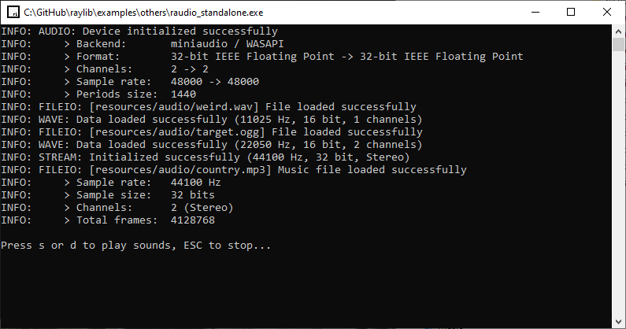

## EXAMPLES LIST

| ##  | module   | example                                                                            | image                                                                                                  | contributor                                       | recent |
|-----|----------|------------------------------------------------------------------------------------|--------------------------------------------------------------------------------------------------------|---------------------------------------------------|--------|
| 01  | core     | [core_basic_window](examples/core/core_basic_window.c)                             |                              |                                                   |        |
| 02  | core     | [core_input_keys](examples/core/core_input_keys.c)                                 |                                  |                                                   |        |
| 03  | core     | [core_input_mouse](examples/core/core_input_mouse.c)                               |                                |                                                   |        |
| 04  | core     | [core_input_mouse_wheel](examples/core/core_input_mouse_wheel.c)                   |                    |                                                   |        |
| 05  | core     | [core_input_gamepad](examples/core/core_input_gamepad.c)                           |                            |                                                   |        |
| 06  | core     | [core_input_multitouch](examples/core/core_input_multitouch.c)                     |                      | [Berni](https://github.com/Berni8k)               |        |
| 07  | core     | [core_input_gestures](examples/core/core_input_gestures.c)                         |                          |                                                   |        |
| 08  | core     | [core_2d_camera](examples/core/core_2d_camera.c)                                   |                                    |                                                   |        |
| 09  | core     | [core_2d_camera_platformer](examples/core/core_2d_camera_platformer.c)             |              | [avyy](https://github.com/avyy)                   | ❕      |
| 10  | core     | [core_3d_camera_mode](examples/core/core_3d_camera_mode.c)                         |                          |                                                   |        |
| 11  | core     | [core_3d_camera_free](examples/core/core_3d_camera_free.c)                         |                          |                                                   |        |
| 12  | core     | [core_3d_camera_first_person](examples/core/core_3d_camera_first_person.c)         |          |                                                   |        |
| 13  | core     | [core_3d_picking](examples/core/core_3d_picking.c)                                 |                                  |                                                   |        |
| 14  | core     | [core_world_screen](examples/core/core_world_screen.c)                             |                              |                                                   |        |
| 15  | core     | [core_custom_logging](examples/core/core_custom_logging.c)                         |                          | [Pablo Marcos Oltra](https://github.com/pamarcos) |        |
| 16  | core     | [core_window_letterbox](examples/core/core_window_letterbox.c)                     |                      | [Anata](https://github.com/anatagawa)             |        |
| 17  | core     | [core_drop_files](examples/core/core_drop_files.c)                                 |                                  |                                                   |        |
| 18  | core     | [core_random_values](examples/core/core_random_values.c)                           |                            |                                                   |        |
| 19  | core     | [core_storage_values](examples/core/core_storage_values.c)                         |                          |                                                   |        |
| 20  | core     | [core_vr_simulator](examples/core/core_vr_simulator.c)                             |                              |                                                   |        |
| 21  | core     | [core_loading_thread](examples/core/core_loading_thread.c)                         |                          |                                                   | ❕      |
| 22  | core     | [core_scissor_test](examples/core/core_scissor_test.c)                             |                              | [Chris Dill](https://github.com/MysteriousSpace)  | ❕      |
| 23  | shapes   | [shapes_basic_shapes](examples/shapes/shapes_basic_shapes.c)                       |                        |                                                   |        |
| 24  | shapes   | [shapes_bouncing_ball](examples/shapes/shapes_bouncing_ball.c)                     |                      |                                                   | ❕      |
| 25  | shapes   | [shapes_colors_palette](examples/shapes/shapes_colors_palette.c)                   |                    |                                                   |        |
| 26  | shapes   | [shapes_logo_raylib](examples/shapes/shapes_logo_raylib.c)                         |                          |                                                   |        |
| 27  | shapes   | [shapes_logo_raylib_anim](examples/shapes/shapes_logo_raylib_anim.c)               |                |                                                   |        |
| 28  | shapes   | [shapes_rectangle_scaling](examples/shapes/shapes_rectangle_scaling.c)             |              | [Vlad Adrian](https://github.com/demizdor)        |        |
| 29  | shapes   | [shapes_lines_bezier](examples/shapes/shapes_lines_bezier.c)                       |                        |                                                   |        |
| 30  | shapes   | [shapes_collision_area](examples/shapes/shapes_collision_area.c)                   |                    |                                                   | ❕      |
| 31  | shapes   | [shapes_following_eyes](examples/shapes/shapes_following_eyes.c)                   |                    |                                                   | ❕      |
| 32  | shapes   | [shapes_easings_ball_anim](examples/shapes/shapes_easings_ball_anim.c)             |              |                                                   | ❕      |
| 33  | shapes   | [shapes_easings_box_anim](examples/shapes/shapes_easings_box_anim.c)               |                |                                                   | ❕      |
| 34  | shapes   | [shapes_easings_rectangle_array](examples/shapes/shapes_easings_rectangle_array.c) |  |                                                   | ❕      |
| 35  | shapes   | [shapes_draw_ring](examples/shapes/shapes_draw_ring.c)                             |                              | [Vlad Adrian](https://github.com/demizdor)        | ❕      |
| 36  | shapes   | [shapes_draw_circle_sector](examples/shapes/shapes_draw_circle_sector.c)           |            | [Vlad Adrian](https://github.com/demizdor)        |        |
| 37  | shapes   | [shapes_draw_rectangle_rounded](examples/shapes/shapes_draw_rectangle_rounded.c)   |    | [Vlad Adrian](https://github.com/demizdor)        |        |
| 38  | text     | [text_raylib_fonts](examples/text/text_raylib_fonts.c)                             |                              |                                                   |        |
| 39  | text     | [text_font_spritefont](examples/text/text_font_spritefont.c)                       |                        |                                                   |        |
| 40  | text     | [text_font_filters](examples/text/text_font_filters.c)                             |                              |                                                   |        |
| 41  | text     | [text_font_loading](examples/text/text_font_loading.c)                             |                              |                                                   |        |
| 42  | text     | [text_font_sdf](examples/text/text_font_sdf.c)                                     |                                      |                                                   | ❕      |
| 43  | text     | [text_format_text](examples/text/text_format_text.c)                               |                                |                                                   |        |
| 44  | text     | [text_input_box](examples/text/text_input_box.c)                                   |                                    |                                                   |        |
| 45  | text     | [text_writing_anim](examples/text/text_writing_anim.c)                             |                              |                                                   |        |
| 46  | text     | [text_rectangle_bounds](examples/text/text_rectangle_bounds.c)                     |                      | [Vlad Adrian](https://github.com/demizdor)        |        |
| 47  | text     | [text_unicode](examples/text/text_unicode.c)                                       |                                        | [Vlad Adrian](https://github.com/demizdor)        |        |
| 48  | textures | [textures_logo_raylib](examples/textures/textures_logo_raylib.c)                   |                    |                                                   |        |
| 49  | textures | [textures_rectangle](examples/textures/textures_rectangle.c)                       |                        |                                                   |        |
| 50  | textures | [textures_srcrec_dstrec](examples/textures/textures_srcrec_dstrec.c)               |                |                                                   |        |
| 51  | textures | [textures_image_drawing](examples/textures/textures_image_drawing.c)               |                |                                                   |        |
| 52  | textures | [textures_image_generation](examples/textures/textures_image_generation.c)         |          |                                                   |        |
| 53  | textures | [textures_image_loading](examples/textures/textures_image_loading.c)               |                |                                                   |        |
| 54  | textures | [textures_image_processing](examples/textures/textures_image_processing.c)         |          |                                                   |        |
| 55  | textures | [textures_image_text](examples/textures/textures_image_text.c)                     |                      |                                                   | ❕      |
| 56  | textures | [textures_to_image](examples/textures/textures_to_image.c)                         |                          |                                                   |        |
| 57  | textures | [textures_raw_data](examples/textures/textures_raw_data.c)                         |                          |                                                   |        |
| 58  | textures | [textures_particles_blending](examples/textures/textures_particles_blending.c)     |      |                                                   |        |
| 59  | textures | [textures_npatch_drawing](examples/textures/textures_npatch_drawing.c)             |              | [Jorge A. Gomes](https://github.com/overdev)      |        |
| 60  | textures | [textures_background_scrolling](examples/textures/textures_background_scrolling.c) |  |                                                   | ❕      |
| 61  | textures | [textures_sprite_button](examples/textures/textures_sprite_button.c)               |                |                                                   | ❕      |
| 62  | textures | [textures_sprite_explosion](examples/textures/textures_sprite_explosion.c)         |          |                                                   | ❕      |
| 63  | textures | [textures_bunnymark](examples/textures/textures_bunnymark.c)                       |                        |                                                   | ❕      |
| 64  | textures | [textures_mouse_painting](examples/textures/textures_mouse_painting.c)             |              | [Chris Dill](https://github.com/MysteriousSpace)  |        |
| 65  | models   | [models_animation](examples/models/models_animation.c)                             |                              | [culacant](https://github.com/culacant)           |        |
| 66  | models   | [models_billboard](examples/models/models_billboard.c)                             |                              |                                                   |        |
| 67  | models   | [models_box_collisions](examples/models/models_box_collisions.c)                   |                    |                                                   |        |
| 68  | models   | [models_cubicmap](examples/models/models_cubicmap.c)                               |                                |                                                   |        |
| 69  | models   | [models_first_person_maze](examples/models/models_first_person_maze.c)             |              |                                                   | ❕      |
| 70  | models   | [models_geometric_shapes](examples/models/models_geometric_shapes.c)               |                |                                                   |        |
| 71  | models   | [models_material_pbr](examples/models/models_material_pbr.c)                       |                        |                                                   |        |
| 72  | models   | [models_mesh_generation](examples/models/models_mesh_generation.c)                 |                  |                                                   |        |
| 73  | models   | [models_mesh_picking](examples/models/models_mesh_picking.c)                       |                        | [Joel Davis](https://github.com/joeld42)          |        |
| 74  | models   | [models_loading](examples/models/models_loading.c)                                 |                                  |                                                   |        |
| 75  | models   | [models_orthographic_projection](examples/models/models_orthographic_projection.c) |  | [Max Danielsson](https://github.com/autious)      |        |
| 76  | models   | [models_rlgl_solar_system_full](examples/models/models_rlgl_solar_system_full.c)   |    | [Aldrin Martoq](https://github.com/aldrinmartoq)  | ❕      |
| 77  | models   | [models_solar_system](examples/models/models_solar_system.c)                       |                        | [Aldrin Martoq](https://github.com/aldrinmartoq)  | ❕      |
| 78  | models   | [models_rlgl_solar_system](examples/models/models_rlgl_solar_system.c)             |              |                                                   | ❕      |
| 79  | models   | [models_yaw_pitch_roll](examples/models/models_yaw_pitch_roll.c)                   |                    | [Berni](https://github.com/Berni8k)               |        |
| 80  | models   | [models_waving_cubes](examples/models/models_waving_cubes.c)                       |                        | [codecat](https://github.com/codecat)             | ❕      |
| 81  | models   | [models_heightmap](examples/models/models_heightmap.c)                             |                              |                                                   |        |
| 82  | models   | [models_skybox](examples/models/models_skybox.c)                                   |                                    |                                                   |        |
| 83  | rlgl     | [shaders_basic_lighting](examples/shaders/shaders_basic_lighting.c)                |                 | [Chris Camacho](https://github.com/codifies)      | ❕      |
| 84  | rlgl     | [shaders_model_shader](examples/shaders/shaders_model_shader.c)                    |                     |                                                   |        |
| 85  | rlgl     | [shaders_shapes_textures](examples/shaders/shaders_shapes_textures.c)              |               |                                                   |        |
| 86  | rlgl     | [shaders_custom_uniform](examples/shaders/shaders_custom_uniform.c)                |                 |                                                   |        |
| 87  | rlgl     | [shaders_postprocessing](examples/shaders/shaders_postprocessing.c)                |                 |                                                   |        |
| 88  | rlgl     | [shaders_palette_switch](examples/shaders/shaders_palette_switch.c)                |                 | [Marco Lizza](https://github.com/MarcoLizza)      |        |
| 89  | rlgl     | [shaders_raymarching](examples/shaders/shaders_raymarching.c)                      |                       | Shader by Iñigo Quilez                            | ❕      |
| 90  | rlgl     | [shaders_texture_drawing](examples/shaders/shaders_texture_drawing.c)              |               | Michał Ciesielski                                 |        |
| 91  | rlgl     | [shaders_texture_waves](examples/shaders/shaders_texture_waves.c)                  |                   | [Anata](https://github.com/anatagawa)             |        |
| 92  | rlgl     | [shaders_julia_set](examples/shaders/shaders_julia_set.c)                          |                           | [eggmund](https://github.com/eggmund)             |        |
| 93  | rlgl     | [shaders_eratosthenes](examples/shaders/shaders_eratosthenes.c)                    |                     | [ProfJski](https://github.com/ProfJski)           |        |
| 94  | rlgl     | [shaders_fog](examples/shaders/shaders_fog.c)                                      |                                       | [Chris Camacho](https://github.com/codifies)      | ❕      |
| 95  | rlgl     | [shaders_simple_mask](examples/shaders/shaders_simple_mask.c)                      |                       | [Chris Camacho](https://github.com/codifies)      | ❕      |
| 96  | raudio   | [audio_module_playing](examples/audio/audio_module_playing.c)                      |                       |                                                   |        |
| 97  | raudio   | [audio_music_stream](examples/audio/audio_music_stream.c)                          |                           |                                                   |        |
| 98  | raudio   | [audio_raw_stream](examples/audio/audio_raw_stream.c)                              |                               |                                                   |        |
| 99  | raudio   | [audio_sound_loading](examples/audio/audio_sound_loading.c)                        |                         |                                                   |        |
| 100 | raudio   | [audio_multichannel_sound](examples/audio/audio_multichannel_sound.c)              |               | [Chris Camacho](https://github.com/codifies)      | ❕      |
| 101 | physac   | [physics_demo](examples/physics/physics_demo.c)                                    |                                     | [Victor Fisac](https://github.com/victorfisac)    |        |
| 102 | physac   | [physics_friction](examples/physics/physics_friction.c)                            |                             | [Victor Fisac](https://github.com/victorfisac)    |        |
| 103 | physac   | [physics_movement](examples/physics/physics_movement.c)                            |                             | [Victor Fisac](https://github.com/victorfisac)    |        |
| 104 | physac   | [physics_restitution](examples/physics/physics_restitution.c)                      |                       | [Victor Fisac](https://github.com/victorfisac)    |        |
| 105 | physac   | [physics_shatter](examples/physics/physics_shatter.c)                              |                               | [Victor Fisac](https://github.com/victorfisac)    |        |
| 106 | rnet     | [network_ping_pong](examples/network/network_ping_pong.c)                          |                           | [Jak Barnes](https://github.com/syphonx)          |        |
| 107 | rnet     | [network_resolve_host](examples/network/network_resolve_host.c)                    |                     | [Jak Barnes](https://github.com/syphonx)          |        |
| 108 | rnet     | [network_tcp_client](examples/network/network_tcp_client.c)                        |                         | [Jak Barnes](https://github.com/syphonx)          |        |
| 109 | rnet     | [network_tcp_server](examples/network/network_tcp_server.c)                        |                         | [Jak Barnes](https://github.com/syphonx)          |        |
| 110 | rnet     | [network_test](examples/network/network_test.c)                                    |                                     | [Jak Barnes](https://github.com/syphonx)          |        |
| 111 | rnet     | [network_udp_client](examples/network/network_udp_client.c)                        |                         | [Jak Barnes](https://github.com/syphonx)          |        |
| 112 | rnet     | [network_udp_server](examples/network/network_udp_server.c)                        |                         | [Jak Barnes](https://github.com/syphonx)          |        |
| 113 | raudio   | [raudio_standalone](examples/others/raudio_standalone.c)                           |                            |                                                   |        |
| 114 | rlgl     | [rlgl_standalone](examples/others/rlgl_standalone.c)                               |                                |                                                   |        |
| 115 | easings  | [easings_testbed](examples/others/easings_testbed.c)                               |                                |                                                   |        |
