## Building the Examples

The examples assume you have already built the `raylib` library in `../src`.

### With GNU make

- `make` builds all examples
- `make [module]` builds all examples for a particular module (e.g `make core`)
- `make [module]/[name]` builds one examples for a particular module (e.g `make core/core_basic_window`)

### With Zig

The [Zig](https://ziglang.org/) toolchain can compile `C` and `C++` in addition to `Zig`.
You may find it easier to use than other toolchains, especially when it comes to cross-compiling.

- `zig build` to compile all examples
- `zig build [module]` to compile all examples for a module (e.g. `zig build core`)
- `zig build [example]` to compile _and run_ a particular example (e.g. `zig build core_basic_window`)

## EXAMPLES COLLECTION [TOTAL: 208]

### category: core [48]

Examples using raylib [core](../src/rcore.c) module platform functionality: window creation, inputs, drawing modes and system functionality.

|  example  | image  | difficulty level | version created | last version updated | original developer |
|-----------|--------|:-------------------:|:------------------:|:-----------------------:|:----------------------|
| [core_basic_window](core/core_basic_window.c) |  | ⭐☆☆☆ | 1.0 | 1.0 | [Ramon Santamaria](https://github.com/raysan5) |
| [core_delta_time](core/core_delta_time.c) | 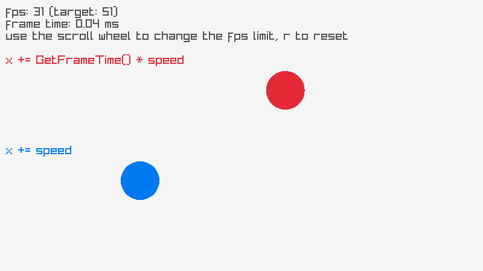 | ⭐☆☆☆ | 5.5 | 5.6-dev | [Robin](https://github.com/RobinsAviary) |
| [core_input_keys](core/core_input_keys.c) |  | ⭐☆☆☆ | 1.0 | 1.0 | [Ramon Santamaria](https://github.com/raysan5) |
| [core_input_mouse](core/core_input_mouse.c) |  | ⭐☆☆☆ | 1.0 | 5.5 | [Ramon Santamaria](https://github.com/raysan5) |
| [core_input_mouse_wheel](core/core_input_mouse_wheel.c) |  | ⭐☆☆☆ | 1.1 | 1.3 | [Ramon Santamaria](https://github.com/raysan5) |
| [core_input_gamepad](core/core_input_gamepad.c) |  | ⭐☆☆☆ | 1.1 | 4.2 | [Ramon Santamaria](https://github.com/raysan5) |
| [core_input_multitouch](core/core_input_multitouch.c) |  | ⭐☆☆☆ | 2.1 | 2.5 | [Berni](https://github.com/Berni8k) |
| [core_input_gestures](core/core_input_gestures.c) |  | ⭐⭐☆☆ | 1.4 | 4.2 | [Ramon Santamaria](https://github.com/raysan5) |
| [core_input_gestures_testbed](core/core_input_gestures_testbed.c) |  | ⭐⭐⭐☆ | 5.0 | 5.6-dev | [ubkp](https://github.com/ubkp) |
| [core_input_virtual_controls](core/core_input_virtual_controls.c) | 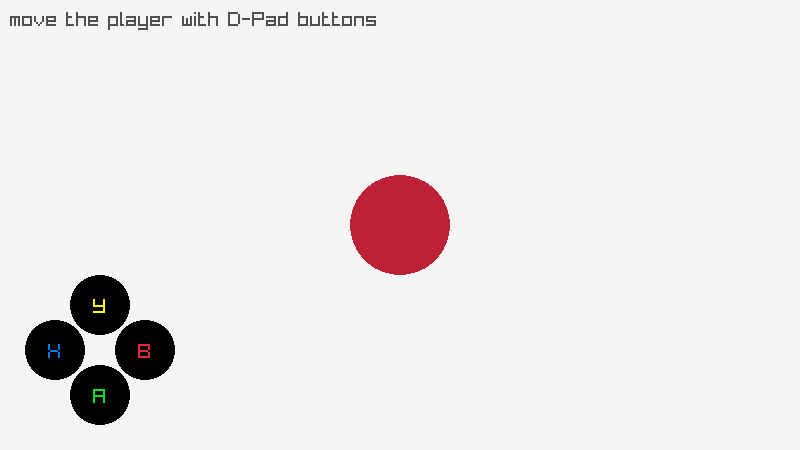 | ⭐⭐☆☆ | 5.0 | 5.0 | [GreenSnakeLinux](https://github.com/GreenSnakeLinux) |
| [core_2d_camera](core/core_2d_camera.c) |  | ⭐⭐☆☆ | 1.5 | 3.0 | [Ramon Santamaria](https://github.com/raysan5) |
| [core_2d_camera_mouse_zoom](core/core_2d_camera_mouse_zoom.c) |  | ⭐⭐☆☆ | 4.2 | 4.2 | [Jeffery Myers](https://github.com/JeffM2501) |
| [core_2d_camera_platformer](core/core_2d_camera_platformer.c) |  | ⭐⭐⭐☆ | 2.5 | 3.0 | [arvyy](https://github.com/arvyy) |
| [core_2d_camera_split_screen](core/core_2d_camera_split_screen.c) |  | ⭐⭐⭐⭐️ | 4.5 | 4.5 | [Gabriel dos Santos Sanches](https://github.com/gabrielssanches) |
| [core_3d_camera_mode](core/core_3d_camera_mode.c) |  | ⭐☆☆☆ | 1.0 | 1.0 | [Ramon Santamaria](https://github.com/raysan5) |
| [core_3d_camera_free](core/core_3d_camera_free.c) |  | ⭐☆☆☆ | 1.3 | 1.3 | [Ramon Santamaria](https://github.com/raysan5) |
| [core_3d_camera_first_person](core/core_3d_camera_first_person.c) |  | ⭐⭐☆☆ | 1.3 | 1.3 | [Ramon Santamaria](https://github.com/raysan5) |
| [core_3d_camera_split_screen](core/core_3d_camera_split_screen.c) |  | ⭐⭐⭐☆ | 3.7 | 4.0 | [Jeffery Myers](https://github.com/JeffM2501) |
| [core_3d_camera_fps](core/core_3d_camera_fps.c) |  | ⭐⭐⭐☆ | 5.5 | 5.5 | [Agnis Aldiņš](https://github.com/nezvers) |
| [core_3d_picking](core/core_3d_picking.c) |  | ⭐⭐☆☆ | 1.3 | 4.0 | [Ramon Santamaria](https://github.com/raysan5) |
| [core_world_screen](core/core_world_screen.c) |  | ⭐⭐☆☆ | 1.3 | 1.4 | [Ramon Santamaria](https://github.com/raysan5) |
| [core_window_flags](core/core_window_flags.c) |  | ⭐⭐⭐☆ | 3.5 | 3.5 | [Ramon Santamaria](https://github.com/raysan5) |
| [core_window_letterbox](core/core_window_letterbox.c) |  | ⭐⭐☆☆ | 2.5 | 4.0 | [Anata](https://github.com/anatagawa) |
| [core_window_should_close](core/core_window_should_close.c) |  | ⭐☆☆☆ | 4.2 | 4.2 | [Ramon Santamaria](https://github.com/raysan5) |
| [core_monitor_detector](core/core_monitor_detector.c) |  | ⭐☆☆☆ | 5.5 | 5.6 | [Maicon Santana](https://github.com/maiconpintoabreu) |
| [core_custom_logging](core/core_custom_logging.c) |  | ⭐⭐⭐☆ | 2.5 | 2.5 | [Pablo Marcos Oltra](https://github.com/pamarcos) |
| [core_drop_files](core/core_drop_files.c) |  | ⭐⭐☆☆ | 1.3 | 4.2 | [Ramon Santamaria](https://github.com/raysan5) |
| [core_random_values](core/core_random_values.c) |  | ⭐☆☆☆ | 1.1 | 1.1 | [Ramon Santamaria](https://github.com/raysan5) |
| [core_storage_values](core/core_storage_values.c) |  | ⭐⭐☆☆ | 1.4 | 4.2 | [Ramon Santamaria](https://github.com/raysan5) |
| [core_vr_simulator](core/core_vr_simulator.c) |  | ⭐⭐⭐☆ | 2.5 | 4.0 | [Ramon Santamaria](https://github.com/raysan5) |
| [core_scissor_test](core/core_scissor_test.c) |  | ⭐☆☆☆ | 2.5 | 3.0 | [Chris Dill](https://github.com/MysteriousSpace) |
| [core_basic_screen_manager](core/core_basic_screen_manager.c) |  | ⭐☆☆☆ | 4.0 | 4.0 | [Ramon Santamaria](https://github.com/raysan5) |
| [core_custom_frame_control](core/core_custom_frame_control.c) |  | ⭐⭐⭐⭐️ | 4.0 | 4.0 | [Ramon Santamaria](https://github.com/raysan5) |
| [core_smooth_pixelperfect](core/core_smooth_pixelperfect.c) |  | ⭐⭐⭐☆ | 3.7 | 4.0 | [Giancamillo Alessandroni](https://github.com/NotManyIdeasDev) |
| [core_random_sequence](core/core_random_sequence.c) |  | ⭐☆☆☆ | 5.0 | 5.0 | [Dalton Overmyer](https://github.com/REDl3east) |
| [core_automation_events](core/core_automation_events.c) |  | ⭐⭐⭐☆ | 5.0 | 5.0 | [Ramon Santamaria](https://github.com/raysan5) |
| [core_highdpi_demo](core/core_highdpi_demo.c) |  | ⭐⭐☆☆ | 5.0 | 5.5 | [Jonathan Marler](https://github.com/marler8997) |
| [core_render_texture](core/core_render_texture.c) |  | ⭐☆☆☆ | 5.6-dev | 5.6-dev | [Ramon Santamaria](https://github.com/raysan5) |
| [core_undo_redo](core/core_undo_redo.c) |  | ⭐⭐⭐☆ | 5.5 | 5.6 | [Ramon Santamaria](https://github.com/raysan5) |
| [core_viewport_scaling](core/core_viewport_scaling.c) |  | ⭐⭐☆☆ | 5.5 | 5.5 | [Agnis Aldiņš](https://github.com/nezvers) |
| [core_input_actions](core/core_input_actions.c) |  | ⭐⭐☆☆ | 5.5 | 5.6 | [Jett](https://github.com/JettMonstersGoBoom) |
| [core_directory_files](core/core_directory_files.c) | 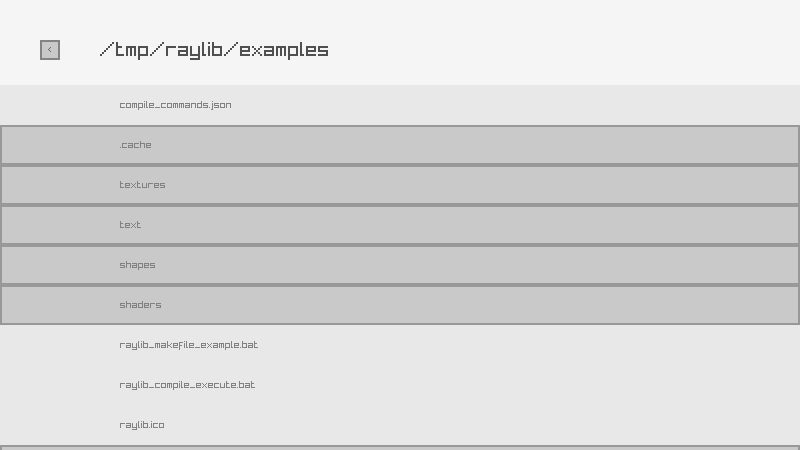 | ⭐☆☆☆ | 5.5 | 5.6 | [Hugo ARNAL](https://github.com/hugoarnal) |
| [core_highdpi_testbed](core/core_highdpi_testbed.c) |  | ⭐☆☆☆ | 5.6-dev | 5.6-dev | [Ramon Santamaria](https://github.com/raysan5) |
| [core_screen_recording](core/core_screen_recording.c) | 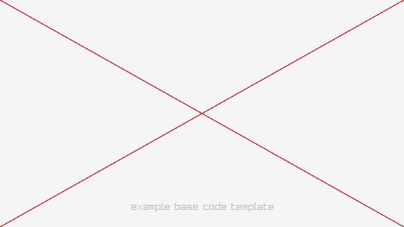 | ⭐⭐☆☆ | 5.6-dev | 5.6-dev | [Ramon Santamaria](https://github.com/raysan5) |
| [core_clipboard_text](core/core_clipboard_text.c) | 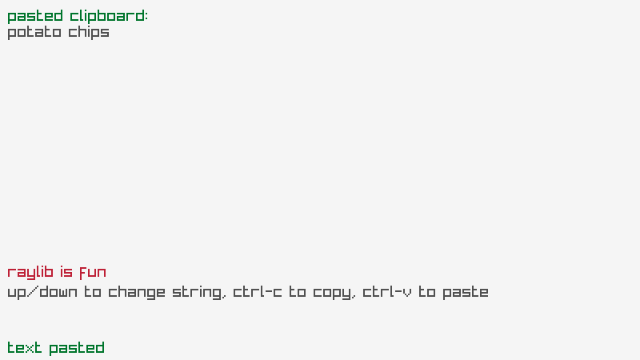 | ⭐⭐☆☆ | 5.6-dev | 5.6-dev | [Ananth S](https://github.com/Ananth1839) |
| [core_text_file_loading](core/core_text_file_loading.c) |  | ⭐☆☆☆ | 5.5 | 5.6 | [Aanjishnu Bhattacharyya](https://github.com/NimComPoo-04) |
| [core_compute_hash](core/core_compute_hash.c) |  | ⭐⭐☆☆ | 5.6-dev | 5.6-dev | [Ramon Santamaria](https://github.com/raysan5) |
| [core_keyboard_testbed](core/core_keyboard_testbed.c) |  | ⭐⭐☆☆ | 5.6 | 5.6 | [Ramon Santamaria](https://github.com/raysan5) |

### category: shapes [39]

Examples using raylib shapes drawing functionality, provided by raylib [shapes](../src/rshapes.c) module.

|  example  | image  | difficulty level | version created | last version updated | original developer |
|-----------|--------|:-------------------:|:------------------:|:-----------------------:|:----------------------|
| [shapes_basic_shapes](shapes/shapes_basic_shapes.c) |  | ⭐☆☆☆ | 1.0 | 4.2 | [Ramon Santamaria](https://github.com/raysan5) |
| [shapes_bouncing_ball](shapes/shapes_bouncing_ball.c) |  | ⭐☆☆☆ | 2.5 | 2.5 | [Ramon Santamaria](https://github.com/raysan5) |
| [shapes_bullet_hell](shapes/shapes_bullet_hell.c) |  | ⭐☆☆☆ | 5.6 | 5.6 | [Zero](https://github.com/zerohorsepower) |
| [shapes_colors_palette](shapes/shapes_colors_palette.c) |  | ⭐⭐☆☆ | 1.0 | 2.5 | [Ramon Santamaria](https://github.com/raysan5) |
| [shapes_logo_raylib](shapes/shapes_logo_raylib.c) |  | ⭐☆☆☆ | 1.0 | 1.0 | [Ramon Santamaria](https://github.com/raysan5) |
| [shapes_logo_raylib_anim](shapes/shapes_logo_raylib_anim.c) |  | ⭐⭐☆☆ | 2.5 | 4.0 | [Ramon Santamaria](https://github.com/raysan5) |
| [shapes_rectangle_scaling](shapes/shapes_rectangle_scaling.c) |  | ⭐⭐☆☆ | 2.5 | 2.5 | [Vlad Adrian](https://github.com/demizdor) |
| [shapes_lines_bezier](shapes/shapes_lines_bezier.c) |  | ⭐☆☆☆ | 1.7 | 1.7 | [Ramon Santamaria](https://github.com/raysan5) |
| [shapes_collision_area](shapes/shapes_collision_area.c) |  | ⭐⭐☆☆ | 2.5 | 2.5 | [Ramon Santamaria](https://github.com/raysan5) |
| [shapes_following_eyes](shapes/shapes_following_eyes.c) |  | ⭐⭐☆☆ | 2.5 | 2.5 | [Ramon Santamaria](https://github.com/raysan5) |
| [shapes_easings_ball](shapes/shapes_easings_ball.c) |  | ⭐⭐☆☆ | 2.5 | 2.5 | [Ramon Santamaria](https://github.com/raysan5) |
| [shapes_easings_box](shapes/shapes_easings_box.c) |  | ⭐⭐☆☆ | 2.5 | 2.5 | [Ramon Santamaria](https://github.com/raysan5) |
| [shapes_easings_rectangles](shapes/shapes_easings_rectangles.c) |  | ⭐⭐⭐☆ | 2.0 | 2.5 | [Ramon Santamaria](https://github.com/raysan5) |
| [shapes_recursive_tree](shapes/shapes_recursive_tree.c) |  | ⭐⭐⭐☆ | 5.6-dev | 5.6-dev | [Jopestpe](https://github.com/jopestpe) |
| [shapes_ring_drawing](shapes/shapes_ring_drawing.c) |  | ⭐⭐⭐☆ | 2.5 | 2.5 | [Vlad Adrian](https://github.com/demizdor) |
| [shapes_circle_sector_drawing](shapes/shapes_circle_sector_drawing.c) |  | ⭐⭐⭐☆ | 2.5 | 2.5 | [Vlad Adrian](https://github.com/demizdor) |
| [shapes_rounded_rectangle_drawing](shapes/shapes_rounded_rectangle_drawing.c) |  | ⭐⭐⭐☆ | 2.5 | 2.5 | [Vlad Adrian](https://github.com/demizdor) |
| [shapes_top_down_lights](shapes/shapes_top_down_lights.c) |  | ⭐⭐⭐⭐️ | 4.2 | 4.2 | [Jeffery Myers](https://github.com/JeffM2501) |
| [shapes_rectangle_advanced](shapes/shapes_rectangle_advanced.c) | 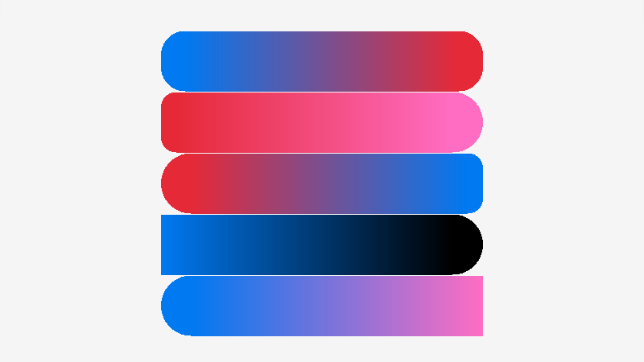 | ⭐⭐⭐⭐️ | 5.5 | 5.5 | [Everton Jr.](https://github.com/evertonse) |
| [shapes_splines_drawing](shapes/shapes_splines_drawing.c) |  | ⭐⭐⭐☆ | 5.0 | 5.0 | [Ramon Santamaria](https://github.com/raysan5) |
| [shapes_digital_clock](shapes/shapes_digital_clock.c) | 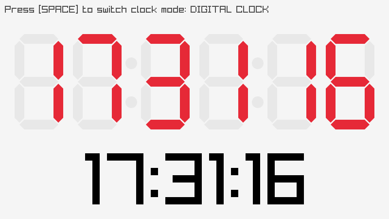 | ⭐⭐⭐⭐️ | 5.5 | 5.6 | [Hamza RAHAL](https://github.com/hmz-rhl) |
| [shapes_double_pendulum](shapes/shapes_double_pendulum.c) |  | ⭐⭐☆☆ | 5.5 | 5.5 | [JoeCheong](https://github.com/Joecheong2006) |
| [shapes_dashed_line](shapes/shapes_dashed_line.c) |  | ⭐☆☆☆ | 5.5 | 5.5 | [Luís Almeida](https://github.com/luis605) |
| [shapes_triangle_strip](shapes/shapes_triangle_strip.c) |  | ⭐⭐☆☆ | 5.6-dev | 5.6-dev | [Jopestpe](https://github.com/jopestpe) |
| [shapes_vector_angle](shapes/shapes_vector_angle.c) |  | ⭐⭐☆☆ | 1.0 | 5.0 | [Ramon Santamaria](https://github.com/raysan5) |
| [shapes_pie_chart](shapes/shapes_pie_chart.c) | 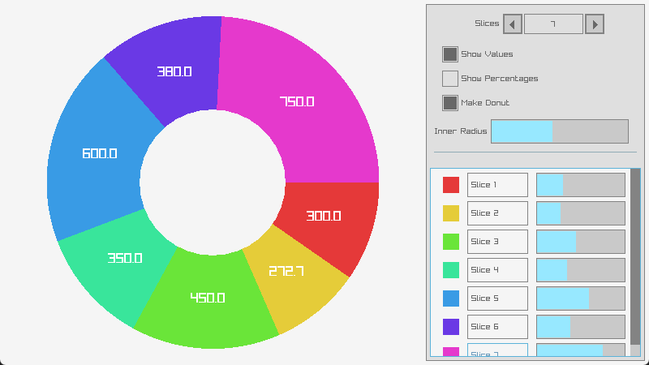 | ⭐⭐⭐☆ | 5.5 | 5.6 | [Gideon Serfontein](https://github.com/GideonSerf) |
| [shapes_kaleidoscope](shapes/shapes_kaleidoscope.c) |  | ⭐⭐☆☆ | 5.5 | 5.6 | [Hugo ARNAL](https://github.com/hugoarnal) |
| [shapes_clock_of_clocks](shapes/shapes_clock_of_clocks.c) |  | ⭐⭐☆☆ | 5.5 | 5.6-dev | [JP Mortiboys](https://github.com/themushroompirates) |
| [shapes_math_sine_cosine](shapes/shapes_math_sine_cosine.c) | 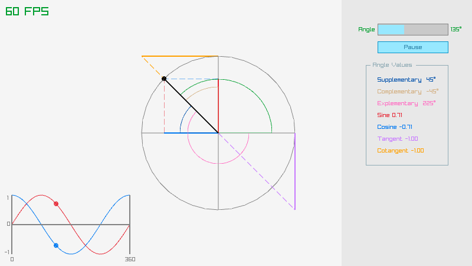 | ⭐⭐☆☆ | 5.6-dev | 5.6-dev | [Jopestpe](https://github.com/jopestpe) |
| [shapes_mouse_trail](shapes/shapes_mouse_trail.c) |  | ⭐☆☆☆ | 5.6 | 5.6-dev | [Balamurugan R](https://github.com/Bala050814) |
| [shapes_simple_particles](shapes/shapes_simple_particles.c) | 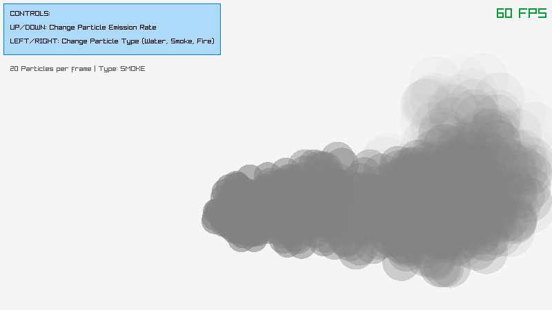 | ⭐⭐☆☆ | 5.6 | 5.6 | [Jordi Santonja](https://github.com/JordSant) |
| [shapes_starfield_effect](shapes/shapes_starfield_effect.c) |  | ⭐⭐☆☆ | 5.5 | 5.6-dev | [JP Mortiboys](https://github.com/themushroompirates) |
| [shapes_lines_drawing](shapes/shapes_lines_drawing.c) |  | ⭐☆☆☆ | 5.6-dev | 5.6 | [Robin](https://github.com/RobinsAviary) |
| [shapes_math_angle_rotation](shapes/shapes_math_angle_rotation.c) |  | ⭐☆☆☆ | 5.6-dev | 5.6 | [Kris](https://github.com/krispy-snacc) |
| [shapes_rlgl_color_wheel](shapes/shapes_rlgl_color_wheel.c) |  | ⭐⭐⭐☆ | 5.6-dev | 5.6-dev | [Robin](https://github.com/RobinsAviary) |
| [shapes_rlgl_triangle](shapes/shapes_rlgl_triangle.c) |  | ⭐⭐☆☆ | 5.6-dev | 5.6-dev | [Robin](https://github.com/RobinsAviary) |
| [shapes_ball_physics](shapes/shapes_ball_physics.c) |  | ⭐⭐☆☆ | 5.6-dev | 5.6-dev | [David Buzatto](https://github.com/davidbuzatto) |
| [shapes_penrose_tile](shapes/shapes_penrose_tile.c) |  | ⭐⭐⭐⭐️ | 5.5 | 5.6-dev | [David Buzatto](https://github.com/davidbuzatto) |
| [shapes_hilbert_curve](shapes/shapes_hilbert_curve.c) |  | ⭐⭐⭐☆ | 5.6 | 5.6 | [Hamza RAHAL](https://github.com/hmz-rhl) |

### category: textures [30]

Examples using raylib textures functionality, including image/textures loading/generation and drawing, provided by raylib [textures](../src/rtextures.c) module.

|  example  | image  | difficulty level | version created | last version updated | original developer |
|-----------|--------|:-------------------:|:------------------:|:-----------------------:|:----------------------|
| [textures_logo_raylib](textures/textures_logo_raylib.c) |  | ⭐☆☆☆ | 1.0 | 1.0 | [Ramon Santamaria](https://github.com/raysan5) |
| [textures_srcrec_dstrec](textures/textures_srcrec_dstrec.c) |  | ⭐⭐⭐☆ | 1.3 | 1.3 | [Ramon Santamaria](https://github.com/raysan5) |
| [textures_image_drawing](textures/textures_image_drawing.c) |  | ⭐⭐☆☆ | 1.4 | 1.4 | [Ramon Santamaria](https://github.com/raysan5) |
| [textures_image_generation](textures/textures_image_generation.c) |  | ⭐⭐☆☆ | 1.8 | 1.8 | [Wilhem Barbier](https://github.com/nounoursheureux) |
| [textures_image_loading](textures/textures_image_loading.c) |  | ⭐☆☆☆ | 1.3 | 1.3 | [Ramon Santamaria](https://github.com/raysan5) |
| [textures_image_processing](textures/textures_image_processing.c) |  | ⭐⭐⭐☆ | 1.4 | 3.5 | [Ramon Santamaria](https://github.com/raysan5) |
| [textures_image_text](textures/textures_image_text.c) |  | ⭐⭐☆☆ | 1.8 | 4.0 | [Ramon Santamaria](https://github.com/raysan5) |
| [textures_to_image](textures/textures_to_image.c) |  | ⭐☆☆☆ | 1.3 | 4.0 | [Ramon Santamaria](https://github.com/raysan5) |
| [textures_raw_data](textures/textures_raw_data.c) |  | ⭐⭐⭐☆ | 1.3 | 3.5 | [Ramon Santamaria](https://github.com/raysan5) |
| [textures_particles_blending](textures/textures_particles_blending.c) |  | ⭐☆☆☆ | 1.7 | 3.5 | [Ramon Santamaria](https://github.com/raysan5) |
| [textures_npatch_drawing](textures/textures_npatch_drawing.c) |  | ⭐⭐⭐☆ | 2.0 | 2.5 | [Jorge A. Gomes](https://github.com/overdev) |
| [textures_background_scrolling](textures/textures_background_scrolling.c) |  | ⭐☆☆☆ | 2.0 | 2.5 | [Ramon Santamaria](https://github.com/raysan5) |
| [textures_sprite_animation](textures/textures_sprite_animation.c) |  | ⭐⭐☆☆ | 1.3 | 1.3 | [Ramon Santamaria](https://github.com/raysan5) |
| [textures_sprite_button](textures/textures_sprite_button.c) |  | ⭐⭐☆☆ | 2.5 | 2.5 | [Ramon Santamaria](https://github.com/raysan5) |
| [textures_sprite_explosion](textures/textures_sprite_explosion.c) |  | ⭐⭐☆☆ | 2.5 | 3.5 | [Ramon Santamaria](https://github.com/raysan5) |
| [textures_bunnymark](textures/textures_bunnymark.c) |  | ⭐⭐⭐☆ | 1.6 | 2.5 | [Ramon Santamaria](https://github.com/raysan5) |
| [textures_mouse_painting](textures/textures_mouse_painting.c) |  | ⭐⭐⭐☆ | 3.0 | 3.0 | [Chris Dill](https://github.com/MysteriousSpace) |
| [textures_blend_modes](textures/textures_blend_modes.c) |  | ⭐☆☆☆ | 3.5 | 3.5 | [Karlo Licudine](https://github.com/accidentalrebel) |
| [textures_tiled_drawing](textures/textures_tiled_drawing.c) |  | ⭐⭐⭐☆ | 3.0 | 4.2 | [Vlad Adrian](https://github.com/demizdor) |
| [textures_polygon_drawing](textures/textures_polygon_drawing.c) |  | ⭐☆☆☆ | 3.7 | 3.7 | [Chris Camacho](https://github.com/chriscamacho) |
| [textures_fog_of_war](textures/textures_fog_of_war.c) |  | ⭐⭐⭐☆ | 4.2 | 4.2 | [Ramon Santamaria](https://github.com/raysan5) |
| [textures_gif_player](textures/textures_gif_player.c) |  | ⭐⭐⭐☆ | 4.2 | 4.2 | [Ramon Santamaria](https://github.com/raysan5) |
| [textures_image_kernel](textures/textures_image_kernel.c) |  | ⭐⭐⭐⭐️ | 1.3 | 1.3 | [Karim Salem](https://github.com/kimo-s) |
| [textures_image_channel](textures/textures_image_channel.c) |  | ⭐⭐☆☆ | 5.5 | 5.5 | [Bruno Cabral](https://github.com/brccabral) |
| [textures_image_rotate](textures/textures_image_rotate.c) |  | ⭐⭐☆☆ | 1.0 | 1.0 | [Ramon Santamaria](https://github.com/raysan5) |
| [textures_screen_buffer](textures/textures_screen_buffer.c) |  | ⭐⭐☆☆ | 5.5 | 5.5 | [Agnis Aldiņš](https://github.com/nezvers) |
| [textures_textured_curve](textures/textures_textured_curve.c) |  | ⭐⭐⭐☆ | 4.5 | 4.5 | [Jeffery Myers](https://github.com/JeffM2501) |
| [textures_sprite_stacking](textures/textures_sprite_stacking.c) |  | ⭐⭐☆☆ | 5.6-dev | 6.0 | [Robin](https://github.com/RobinsAviary) |
| [textures_cellular_automata](textures/textures_cellular_automata.c) |  | ⭐⭐☆☆ | 5.6 | 5.6 | [Jordi Santonja](https://github.com/JordSant) |
| [textures_framebuffer_rendering](textures/textures_framebuffer_rendering.c) |  | ⭐⭐☆☆ | 5.6 | 5.6 | [Jack Boakes](https://github.com/jackboakes) |

### category: text [16]

Examples using raylib text functionality, including sprite fonts loading/generation and text drawing, provided by raylib [text](../src/rtext.c) module.

|  example  | image  | difficulty level | version created | last version updated | original developer |
|-----------|--------|:-------------------:|:------------------:|:-----------------------:|:----------------------|
| [text_sprite_fonts](text/text_sprite_fonts.c) |  | ⭐☆☆☆ | 1.7 | 3.7 | [Ramon Santamaria](https://github.com/raysan5) |
| [text_font_spritefont](text/text_font_spritefont.c) |  | ⭐☆☆☆ | 1.0 | 1.0 | [Ramon Santamaria](https://github.com/raysan5) |
| [text_font_filters](text/text_font_filters.c) |  | ⭐⭐☆☆ | 1.3 | 4.2 | [Ramon Santamaria](https://github.com/raysan5) |
| [text_font_loading](text/text_font_loading.c) |  | ⭐☆☆☆ | 1.4 | 3.0 | [Ramon Santamaria](https://github.com/raysan5) |
| [text_font_sdf](text/text_font_sdf.c) |  | ⭐⭐⭐☆ | 1.3 | 4.0 | [Ramon Santamaria](https://github.com/raysan5) |
| [text_format_text](text/text_format_text.c) |  | ⭐☆☆☆ | 1.1 | 3.0 | [Ramon Santamaria](https://github.com/raysan5) |
| [text_input_box](text/text_input_box.c) |  | ⭐⭐☆☆ | 1.7 | 3.5 | [Ramon Santamaria](https://github.com/raysan5) |
| [text_writing_anim](text/text_writing_anim.c) |  | ⭐⭐☆☆ | 1.4 | 1.4 | [Ramon Santamaria](https://github.com/raysan5) |
| [text_rectangle_bounds](text/text_rectangle_bounds.c) |  | ⭐⭐⭐⭐️ | 2.5 | 4.0 | [Vlad Adrian](https://github.com/demizdor) |
| [text_unicode_emojis](text/text_unicode_emojis.c) |  | ⭐⭐⭐⭐️ | 2.5 | 4.0 | [Vlad Adrian](https://github.com/demizdor) |
| [text_unicode_ranges](text/text_unicode_ranges.c) |  | ⭐⭐⭐⭐️ | 5.5 | 5.6 | [Vadim Gunko](https://github.com/GuvaCode) |
| [text_3d_drawing](text/text_3d_drawing.c) |  | ⭐⭐⭐⭐️ | 3.5 | 4.0 | [Vlad Adrian](https://github.com/demizdor) |
| [text_codepoints_loading](text/text_codepoints_loading.c) |  | ⭐⭐⭐☆ | 4.2 | 4.2 | [Ramon Santamaria](https://github.com/raysan5) |
| [text_inline_styling](text/text_inline_styling.c) |  | ⭐⭐⭐☆ | 5.6-dev | 5.6-dev | [Wagner Barongello](https://github.com/SultansOfCode) |
| [text_words_alignment](text/text_words_alignment.c) |  | ⭐☆☆☆ | 5.6-dev | 5.6-dev | [JP Mortiboys](https://github.com/themushroompirates) |
| [text_strings_management](text/text_strings_management.c) |  | ⭐⭐⭐☆ | 5.6-dev | 5.6-dev | [David Buzatto](https://github.com/davidbuzatto) |

### category: models [27]

Examples using raylib models functionality, including models loading/generation and drawing, provided by raylib [models](../src/rmodels.c) module.

|  example  | image  | difficulty level | version created | last version updated | original developer |
|-----------|--------|:-------------------:|:------------------:|:-----------------------:|:----------------------|
| [models_animation_playing](models/models_animation_playing.c) |  | ⭐⭐☆☆ | 2.5 | 3.5 | [Culacant](https://github.com/culacant) |
| [models_billboard_rendering](models/models_billboard_rendering.c) |  | ⭐⭐⭐☆ | 1.3 | 3.5 | [Ramon Santamaria](https://github.com/raysan5) |
| [models_box_collisions](models/models_box_collisions.c) |  | ⭐☆☆☆ | 1.3 | 3.5 | [Ramon Santamaria](https://github.com/raysan5) |
| [models_cubicmap_rendering](models/models_cubicmap_rendering.c) | 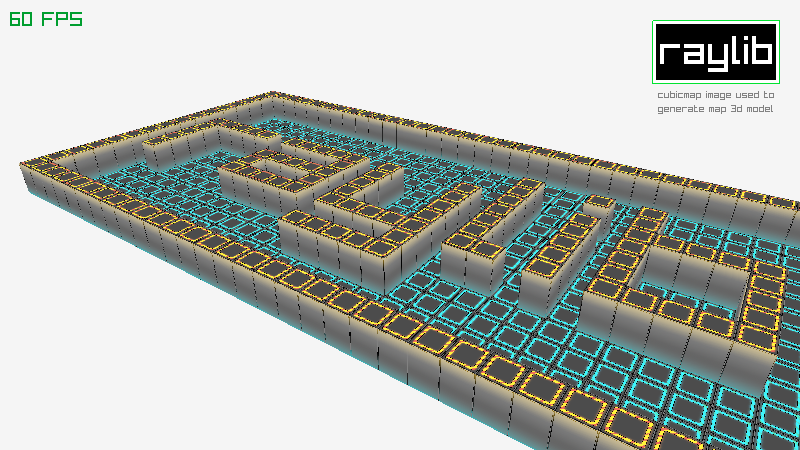 | ⭐⭐☆☆ | 1.8 | 3.5 | [Ramon Santamaria](https://github.com/raysan5) |
| [models_first_person_maze](models/models_first_person_maze.c) |  | ⭐⭐☆☆ | 2.5 | 3.5 | [Ramon Santamaria](https://github.com/raysan5) |
| [models_geometric_shapes](models/models_geometric_shapes.c) |  | ⭐☆☆☆ | 1.0 | 3.5 | [Ramon Santamaria](https://github.com/raysan5) |
| [models_mesh_generation](models/models_mesh_generation.c) |  | ⭐⭐☆☆ | 1.8 | 4.0 | [Ramon Santamaria](https://github.com/raysan5) |
| [models_mesh_picking](models/models_mesh_picking.c) |  | ⭐⭐⭐☆ | 1.7 | 4.0 | [Joel Davis](https://github.com/joeld42) |
| [models_loading](models/models_loading.c) |  | ⭐☆☆☆ | 2.0 | 4.2 | [Ramon Santamaria](https://github.com/raysan5) |
| [models_loading_gltf](models/models_loading_gltf.c) |  | ⭐☆☆☆ | 3.7 | 4.2 | [Ramon Santamaria](https://github.com/raysan5) |
| [models_loading_vox](models/models_loading_vox.c) |  | ⭐☆☆☆ | 4.0 | 4.0 | [Johann Nadalutti](https://github.com/procfxgen) |
| [models_loading_m3d](models/models_loading_m3d.c) |  | ⭐⭐☆☆ | 4.5 | 4.5 | [bzt](https://github.com/bztsrc) |
| [models_orthographic_projection](models/models_orthographic_projection.c) |  | ⭐☆☆☆ | 2.0 | 3.7 | [Max Danielsson](https://github.com/autious) |
| [models_point_rendering](models/models_point_rendering.c) |  | ⭐⭐⭐☆ | 5.0 | 5.0 | [Reese Gallagher](https://github.com/satchelfrost) |
| [models_rlgl_solar_system](models/models_rlgl_solar_system.c) |  | ⭐⭐⭐⭐️ | 2.5 | 4.0 | [Ramon Santamaria](https://github.com/raysan5) |
| [models_yaw_pitch_roll](models/models_yaw_pitch_roll.c) |  | ⭐⭐☆☆ | 1.8 | 4.0 | [Berni](https://github.com/Berni8k) |
| [models_waving_cubes](models/models_waving_cubes.c) |  | ⭐⭐⭐☆ | 2.5 | 3.7 | [Codecat](https://github.com/codecat) |
| [models_heightmap_rendering](models/models_heightmap_rendering.c) |  | ⭐☆☆☆ | 1.8 | 3.5 | [Ramon Santamaria](https://github.com/raysan5) |
| [models_skybox_rendering](models/models_skybox_rendering.c) |  | ⭐⭐☆☆ | 1.8 | 4.0 | [Ramon Santamaria](https://github.com/raysan5) |
| [models_textured_cube](models/models_textured_cube.c) |  | ⭐⭐☆☆ | 4.5 | 4.5 | [Ramon Santamaria](https://github.com/raysan5) |
| [models_animation_gpu_skinning](models/models_animation_gpu_skinning.c) | 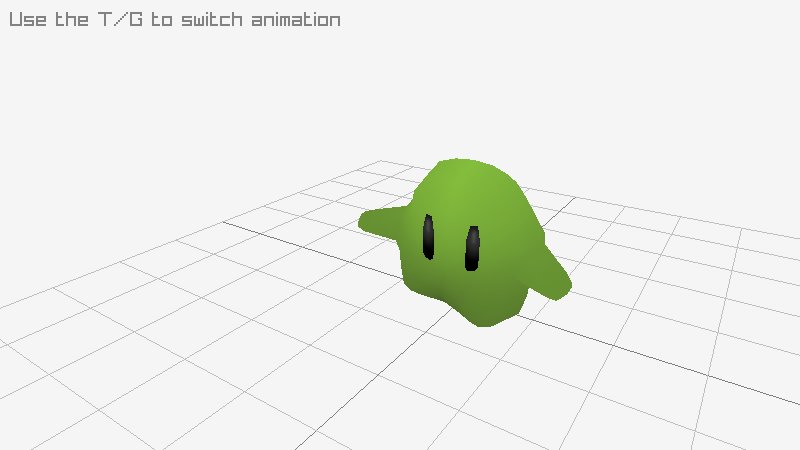 | ⭐⭐⭐☆ | 4.5 | 4.5 | [Daniel Holden](https://github.com/orangeduck) |
| [models_bone_socket](models/models_bone_socket.c) |  | ⭐⭐⭐⭐️ | 4.5 | 4.5 | [iP](https://github.com/ipzaur) |
| [models_tesseract_view](models/models_tesseract_view.c) |  | ⭐⭐☆☆ | 5.6-dev | 5.6-dev | [Timothy van der Valk](https://github.com/arceryz) |
| [models_basic_voxel](models/models_basic_voxel.c) | 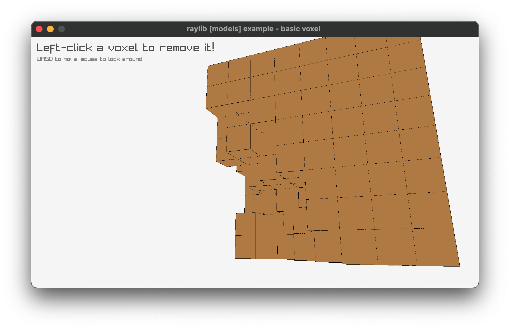 | ⭐⭐☆☆ | 5.5 | 5.5 | [Tim Little](https://github.com/timlittle) |
| [models_rotating_cube](models/models_rotating_cube.c) |  | ⭐☆☆☆ | 5.6-dev | 5.6-dev | [Jopestpe](https://github.com/jopestpe) |
| [models_decals](models/models_decals.c) |  | ⭐⭐⭐⭐️ | 5.6-dev | 5.6-dev | [JP Mortiboys](https://github.com/themushroompirates) |
| [models_directional_billboard](models/models_directional_billboard.c) |  | ⭐⭐☆☆ | 5.6-dev | 5.6 | [Robin](https://github.com/RobinsAviary) |

### category: shaders [33]

Examples using raylib shaders functionality, including shaders loading, parameters configuration and drawing using them (model shaders and postprocessing shaders). This functionality is directly provided by raylib [rlgl](../src/rlgl.c) module.

|  example  | image  | difficulty level | version created | last version updated | original developer |
|-----------|--------|:-------------------:|:------------------:|:-----------------------:|:----------------------|
| [shaders_ascii_rendering](shaders/shaders_ascii_rendering.c) |  | ⭐⭐☆☆ | 5.5 | 5.6 | [Maicon Santana](https://github.com/maiconpintoabreu) |
| [shaders_basic_lighting](shaders/shaders_basic_lighting.c) |  | ⭐⭐⭐⭐️ | 3.0 | 4.2 | [Chris Camacho](https://github.com/chriscamacho) |
| [shaders_model_shader](shaders/shaders_model_shader.c) |  | ⭐⭐☆☆ | 1.3 | 3.7 | [Ramon Santamaria](https://github.com/raysan5) |
| [shaders_shapes_textures](shaders/shaders_shapes_textures.c) |  | ⭐⭐☆☆ | 1.7 | 3.7 | [Ramon Santamaria](https://github.com/raysan5) |
| [shaders_custom_uniform](shaders/shaders_custom_uniform.c) |  | ⭐⭐☆☆ | 1.3 | 4.0 | [Ramon Santamaria](https://github.com/raysan5) |
| [shaders_postprocessing](shaders/shaders_postprocessing.c) |  | ⭐⭐⭐☆ | 1.3 | 4.0 | [Ramon Santamaria](https://github.com/raysan5) |
| [shaders_palette_switch](shaders/shaders_palette_switch.c) |  | ⭐⭐⭐☆ | 2.5 | 3.7 | [Marco Lizza](https://github.com/MarcoLizza) |
| [shaders_raymarching_rendering](shaders/shaders_raymarching_rendering.c) |  | ⭐⭐⭐⭐️ | 2.0 | 4.2 | [Ramon Santamaria](https://github.com/raysan5) |
| [shaders_texture_rendering](shaders/shaders_texture_rendering.c) |  | ⭐⭐☆☆ | 2.0 | 3.7 | [Michał Ciesielski](https://github.com/ciessielski) |
| [shaders_texture_outline](shaders/shaders_texture_outline.c) |  | ⭐⭐⭐☆ | 4.0 | 4.0 | [Serenity Skiff](https://github.com/GoldenThumbs) |
| [shaders_texture_waves](shaders/shaders_texture_waves.c) |  | ⭐⭐☆☆ | 2.5 | 3.7 | [Anata](https://github.com/anatagawa) |
| [shaders_julia_set](shaders/shaders_julia_set.c) |  | ⭐⭐⭐☆ | 2.5 | 4.0 | [Josh Colclough](https://github.com/joshcol9232) |
| [shaders_mandelbrot_set](shaders/shaders_mandelbrot_set.c) |  | ⭐⭐⭐☆ | 5.6 | 5.6 | [Jordi Santonja](https://github.com/JordSant) |
| [shaders_color_correction](shaders/shaders_color_correction.c) |  | ⭐⭐☆☆ | 5.6 | 5.6 | [Jordi Santonja](https://github.com/JordSant) |
| [shaders_eratosthenes_sieve](shaders/shaders_eratosthenes_sieve.c) |  | ⭐⭐⭐☆ | 2.5 | 4.0 | [ProfJski](https://github.com/ProfJski) |
| [shaders_fog_rendering](shaders/shaders_fog_rendering.c) |  | ⭐⭐⭐☆ | 2.5 | 3.7 | [Chris Camacho](https://github.com/chriscamacho) |
| [shaders_simple_mask](shaders/shaders_simple_mask.c) |  | ⭐⭐☆☆ | 2.5 | 3.7 | [Chris Camacho](https://github.com/chriscamacho) |
| [shaders_hot_reloading](shaders/shaders_hot_reloading.c) |  | ⭐⭐⭐☆ | 3.0 | 3.5 | [Ramon Santamaria](https://github.com/raysan5) |
| [shaders_mesh_instancing](shaders/shaders_mesh_instancing.c) |  | ⭐⭐⭐⭐️ | 3.7 | 4.2 | [seanpringle](https://github.com/seanpringle) |
| [shaders_multi_sample2d](shaders/shaders_multi_sample2d.c) |  | ⭐⭐☆☆ | 3.5 | 3.5 | [Ramon Santamaria](https://github.com/raysan5) |
| [shaders_normalmap_rendering](shaders/shaders_normalmap_rendering.c) |  | ⭐⭐⭐⭐️ | 5.6 | 5.6 | [Jeremy Montgomery](https://github.com/Sir_Irk) |
| [shaders_spotlight_rendering](shaders/shaders_spotlight_rendering.c) |  | ⭐⭐☆☆ | 2.5 | 3.7 | [Chris Camacho](https://github.com/chriscamacho) |
| [shaders_deferred_rendering](shaders/shaders_deferred_rendering.c) |  | ⭐⭐⭐⭐️ | 4.5 | 4.5 | [Justin Andreas Lacoste](https://github.com/27justin) |
| [shaders_hybrid_rendering](shaders/shaders_hybrid_rendering.c) |  | ⭐⭐⭐⭐️ | 4.2 | 4.2 | [Buğra Alptekin Sarı](https://github.com/BugraAlptekinSari) |
| [shaders_texture_tiling](shaders/shaders_texture_tiling.c) |  | ⭐⭐☆☆ | 4.5 | 4.5 | [Luis Almeida](https://github.com/luis605) |
| [shaders_shadowmap_rendering](shaders/shaders_shadowmap_rendering.c) |  | ⭐⭐⭐⭐️ | 5.0 | 5.0 | [TheManTheMythTheGameDev](https://github.com/TheManTheMythTheGameDev) |
| [shaders_vertex_displacement](shaders/shaders_vertex_displacement.c) |  | ⭐⭐⭐☆ | 5.0 | 4.5 | [Alex ZH](https://github.com/ZzzhHe) |
| [shaders_depth_writing](shaders/shaders_depth_writing.c) |  | ⭐⭐☆☆ | 4.2 | 4.2 | [Buğra Alptekin Sarı](https://github.com/BugraAlptekinSari) |
| [shaders_basic_pbr](shaders/shaders_basic_pbr.c) |  | ⭐⭐⭐⭐️ | 5.0 | 5.5 | [Afan OLOVCIC](https://github.com/_DevDad) |
| [shaders_lightmap_rendering](shaders/shaders_lightmap_rendering.c) |  | ⭐⭐⭐☆ | 4.5 | 4.5 | [Jussi Viitala](https://github.com/nullstare) |
| [shaders_rounded_rectangle](shaders/shaders_rounded_rectangle.c) |  | ⭐⭐⭐☆ | 5.5 | 5.5 | [Anstro Pleuton](https://github.com/anstropleuton) |
| [shaders_depth_rendering](shaders/shaders_depth_rendering.c) |  | ⭐⭐⭐☆ | 5.6-dev | 5.6-dev | [Luís Almeida](https://github.com/luis605) |
| [shaders_game_of_life](shaders/shaders_game_of_life.c) |  | ⭐⭐⭐☆ | 5.6 | 5.6 | [Jordi Santonja](https://github.com/JordSant) |

### category: audio [9]

Examples using raylib audio functionality, including sound/music loading and playing. This functionality is provided by raylib [raudio](../src/raudio.c) module. Note this module can be used standalone independently of raylib.

|  example  | image  | difficulty level | version created | last version updated | original developer |
|-----------|--------|:-------------------:|:------------------:|:-----------------------:|:----------------------|
| [audio_module_playing](audio/audio_module_playing.c) |  | ⭐☆☆☆ | 1.5 | 3.5 | [Ramon Santamaria](https://github.com/raysan5) |
| [audio_music_stream](audio/audio_music_stream.c) |  | ⭐☆☆☆ | 1.3 | 4.2 | [Ramon Santamaria](https://github.com/raysan5) |
| [audio_raw_stream](audio/audio_raw_stream.c) |  | ⭐⭐⭐☆ | 1.6 | 4.2 | [Ramon Santamaria](https://github.com/raysan5) |
| [audio_sound_loading](audio/audio_sound_loading.c) |  | ⭐☆☆☆ | 1.1 | 3.5 | [Ramon Santamaria](https://github.com/raysan5) |
| [audio_mixed_processor](audio/audio_mixed_processor.c) |  | ⭐⭐⭐⭐️ | 4.2 | 4.2 | [hkc](https://github.com/hatkidchan) |
| [audio_stream_effects](audio/audio_stream_effects.c) |  | ⭐⭐⭐⭐️ | 4.2 | 5.0 | [Ramon Santamaria](https://github.com/raysan5) |
| [audio_sound_multi](audio/audio_sound_multi.c) |  | ⭐⭐☆☆ | 5.0 | 5.0 | [Jeffery Myers](https://github.com/JeffM2501) |
| [audio_sound_positioning](audio/audio_sound_positioning.c) | 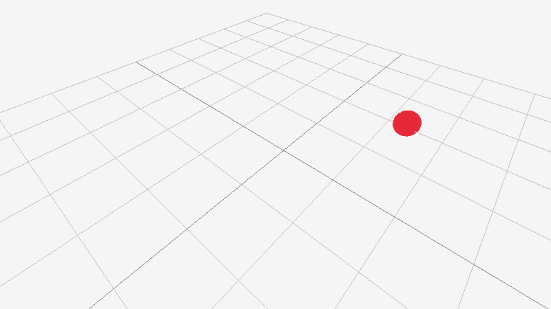 | ⭐⭐☆☆ | 5.5 | 5.5 | [Le Juez Victor](https://github.com/Bigfoot71) |
| [audio_spectrum_visualizer](audio/audio_spectrum_visualizer.c) |  | ⭐⭐⭐☆ | 6.0 | 5.6-dev | [IANN](https://github.com/meisei4) |

### category: others [6]

Examples showing raylib misc functionality that does not fit in other categories, like standalone modules usage or examples integrating external libraries.

|  example  | image  | difficulty level | version created | last version updated | original developer |
|-----------|--------|:-------------------:|:------------------:|:-----------------------:|:----------------------|
| [rlgl_standalone](others/rlgl_standalone.c) |  | ⭐⭐⭐⭐️ | 1.6 | 4.0 | [Ramon Santamaria](https://github.com/raysan5) |
| [rlgl_compute_shader](others/rlgl_compute_shader.c) |  | ⭐⭐⭐⭐️ | 4.0 | 4.0 | [Teddy Astie](https://github.com/tsnake41) |
| [easings_testbed](others/easings_testbed.c) |  | ⭐⭐⭐☆ | 2.5 | 3.0 | [Juan Miguel López](https://github.com/flashback-fx) |
| [raylib_opengl_interop](others/raylib_opengl_interop.c) |  | ⭐⭐⭐⭐️ | 3.8 | 4.0 | [Stephan Soller](https://github.com/arkanis) |
| [embedded_files_loading](others/embedded_files_loading.c) |  | ⭐⭐☆☆ | 3.0 | 3.5 | [Kristian Holmgren](https://github.com/defutura) |
| [web_basic_window](others/web_basic_window.c) |  | ⭐☆☆☆ | 5.6-dev | 5.6-dev | [Ramon Santamaria](https://github.com/raysan5) |

Some example missing? As always, contributions are welcome, feel free to send new examples!
Here is an [examples template](examples_template.c) with instructions to start with!
