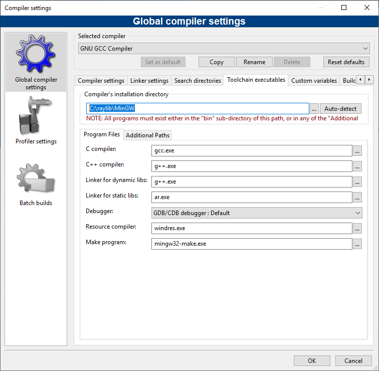

# raylib template for Code::Blocks

1. Install raylib. 

On Windows you should install the **Windows Installer (with MinGW compiler)** package.
On other platforms you can install however you like following the instructions in the wiki.

    * https://github.com/raysan5/raylib/releases/download/4.2.0/raylib_installer_v420.mingw.exe
    * https://github.com/raysan5/raylib/wiki/Working-on-GNU-Linux
    * https://github.com/raysan5/raylib/wiki/Working-on-macOS

2. Install and run Code::Blocks.

3. **Windows only**: Select `Settings` `Compiler` `Toolchain executables`.
Change `Compiler's installation directory` to `C:\raylib\MingGW`.  Do *not* press auto-detect.
There is a screenshot below showing how it should look.  Press `OK`.

4. Select `File` `Open` and open the `core_basic_windows.cbp` file.

For an example with resources, see https://github.com/electronstudio/raylib-game-template-codeblocks